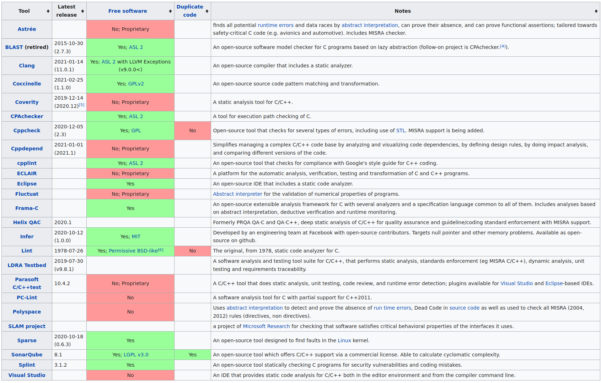
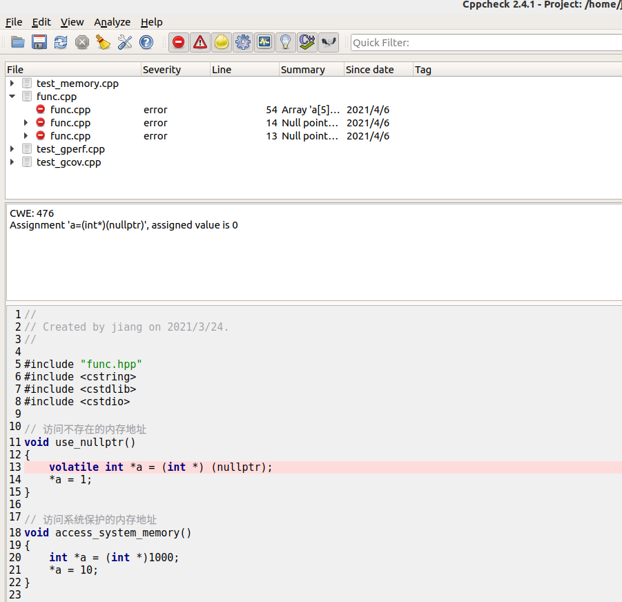
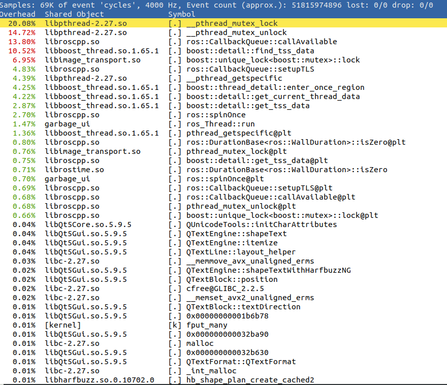
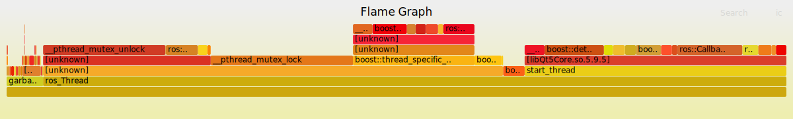
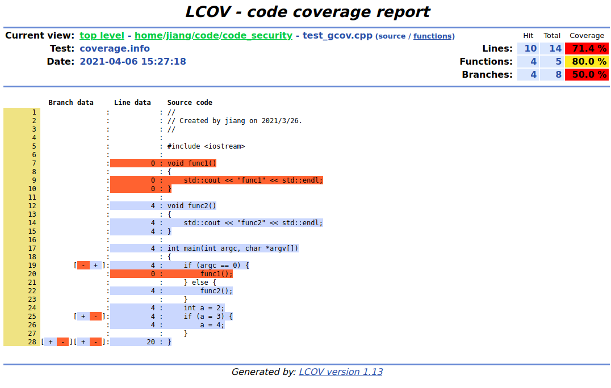
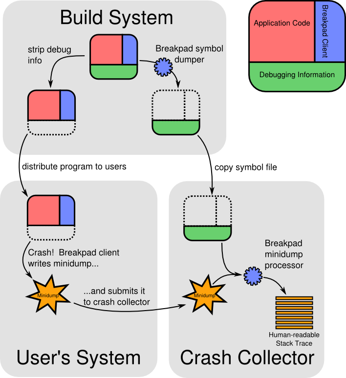

# 代码检测工具

## 静态检测

https://en.wikipedia.org/wiki/List_of_tools_for_static_code_analysis#C,_C++



### pvs-studio


下载包链接：https://files.viva64.com/pvs-studio-7.12.46137.116-amd64.deb

官方文档连接：https://www.viva64.com/en/m/0036/

破解license

```
PVSStudio_sanet.st
0XZ0-3UPU-29T1-7RGB
```

注册license

```bash
pvs-studio-analyzer credentials PVSStudio_sanet.st 0XZ0-3UPU-29T1-7RGB
```

示例操作：

```bash
# 根据构建脚本编译的源文件生成跟踪，自动抓取需要分析的源文件，会自动生成analyse.log文件
pvs-studio-analyzer trace -- ./build.sh
# 使用工具分析源代码
pvs-studio-analyzer analyze -j4 -o analyse.log

# 如果使用CMake编译，可以打开`CMAKE_EXPORT_COMPILE_COMMANDS`，生成`compile_commands.json`，然后指定
pvs-studio-analyzer analyze -f xxx/compile_commands.json -j4 -o analyse.log
# 把分析结果转换成文字报告result.txt
plog-converter -a GA:1,2 -t tasklist -o result.txt analyse.log
```

使用上述命令分析仓库中`test_memory_none`目标

```bash
mkdir build
cd build
cmake ..
pvs-studio-analyzer trace -- make test_memory_none  #该命令会自动生成一个strace_out文件记录着编译用到的文件
pvs-studio-analyzer analyze -j4 -o analyse.log #生成结果
plog-converter -a GA:1,2 -t tasklist -o result.txt analyse.log #转文字报告
```

最终`result.txt`里面的内容

<details>
  <summary>结果</summary>

```
 www.viva64.com/en/w>1>  err>Help: The documentation for all analyzer warnings is available here: https://www.viva64.com/en/w/.
    1 /home/jiang/code/code_security/func.cpp>28> err>V675 Calling the 'strcpy' function will cause the writing into the read-only memory. Inspect the first argument.
    2 /home/jiang/code/code_security/func.cpp>48> err>V774 The 'str' pointer was used after the memory was released.
    3 /home/jiang/code/code_security/func.cpp>54> err>V557 Array overrun is possible. The '100' index is pointing beyond array bound.
    4 /home/jiang/code/code_security/test_gcov.cpp>   25> warn>   V547 Expression 'a = 3' is always true.
    5 /home/jiang/code/code_security/test_gcov.cpp>   25> warn>   V559 Suspicious assignment inside the conditional expression of 'if' statement: a = 3.
    6 /home/jiang/code/code_security/test_gperf.cpp>  19> warn>   V799 The 'p' variable is not used after memory has been allocated for it. Consider checking the use of this variable.
    7 /home/jiang/code/code_security/test_gperf.cpp>  43> err>V530 The return value of function 'create' is required to be utilized.
    8 /home/jiang/code/code_security/test_memory.cpp> 50> err>V512 A call of the 'memcpy' function will lead to the '"dddddd"' buffer becoming out of range.
    9 /home/jiang/code/code_security/test_memory.cpp> 52> warn>   V557 Array overrun is possible. The value of 'i' index could reach 24.
   10 /home/jiang/code/code_security/test_memory.cpp> 56> err>V774 The 'buff' pointer was used after the memory was released.
   11 /home/jiang/code/code_security/test_memory.cpp> 57> warn>   V799 The 'buggy' variable is not used after memory has been allocated for it. Consider checking the use of this variable.
   12 /home/jiang/code/code_security/test_memory.cpp> 59> warn>   V799 The 'normal' variable is not used after memory has been allocated for it. Consider checking the use of this variable.
   13 /home/jiang/code/code_security/test_memory.cpp> 67> err>V614 Uninitialized variable 'global' used.

```

</details>

### clang-tidy

建议安装最新的llvm

官方安装文档链接：https://apt.llvm.org/

执行脚本就会自动添加apt源

```bash
bash -c "$(wget -O - https://apt.llvm.org/llvm.sh)"
```

然后用apt安装

```bash
sudo apt install clang-tidy-12
```

clang-tidy可以和很多IDE集成，包括vscode，vim，Clion，QtCreator等，也可以单独使用命令检测源文件

比较推荐的是用CMake集成，在编译代码时会打印警告信息

```cmake
# 查找clang-tidy
find_program(CLANG_TIDY_EXE NAMES "clang-tidy-12" DOC "Path to clang-tidy executable")
if (NOT CLANG_TIDY_EXE)
    message(STATUS "clang-tidy not found.")
else ()
    message(STATUS "clang-tidy found: ${CLANG_TIDY_EXE}")
    set(DO_CLANG_TIDY "${CLANG_TIDY_EXE}" "-checks=*,-clang-analyzer-*")
endif ()

# 生成目标
add_executable(test_clang_tidy test_breakpad.cpp func.cpp func.hpp)
target_link_libraries(test_clang_tidy
        ${BREAKPAD_CLIENT_LIBRARIES}
        pthread)
# 集成clang-tidy
if (CLANG_TIDY_EXE)
    set_target_properties(test_clang_tidy PROPERTIES CXX_CLANG_TIDY "${DO_CLANG_TIDY}")
endif ()
```

clang-tidy可以设置很多检查配置参数，详细参考：

https://clang.llvm.org/extra/clang-tidy/#id2

https://clang.llvm.org/extra/clang-tidy/checks/list.html

示例：

直接用命令编译仓库中的`test_clang_tidy`目标，得到命令行结果

<details>
  <summary>结果</summary>

```
❯ make test_clang_tidy
Scanning dependencies of target test_clang_tidy
[ 33%] Building CXX object CMakeFiles/test_clang_tidy.dir/test_breakpad.cpp.o
/home/jiang/code/code_security/test_breakpad.cpp:6:1: warning: #includes are not sorted properly [llvm-include-order]
#include <breakpad/client/linux/handler/exception_handler.h>
^
note: this fix will not be applied because it overlaps with another fix
/home/jiang/code/code_security/test_breakpad.cpp:6:1: warning: system include breakpad/client/linux/handler/exception_handler.h not allowed [llvmlibc-restrict-system-libc-headers]
#include <breakpad/client/linux/handler/exception_handler.h>
^~~~~~~~~~~~~~~~~~~~~~~~~~~~~~~~~~~~~~~~~~~~~~~~~~~~~~~~~~~~
/home/jiang/code/code_security/test_breakpad.cpp:7:1: warning: system include breakpad/client/linux/crash_generation/crash_generation_server.h not allowed [llvmlibc-restrict-system-libc-headers]
#include <breakpad/client/linux/crash_generation/crash_generation_server.h>
^~~~~~~~~~~~~~~~~~~~~~~~~~~~~~~~~~~~~~~~~~~~~~~~~~~~~~~~~~~~~~~~~~~~~~~~~~~
/home/jiang/code/code_security/test_breakpad.cpp:9:1: warning: system include iostream not allowed [llvmlibc-restrict-system-libc-headers]
#include <iostream>
^~~~~~~~~~~~~~~~~~~
/home/jiang/code/code_security/test_breakpad.cpp:11:1: warning: do not use namespace using-directives; use using-declarations instead [google-build-using-namespace]
using namespace google_breakpad;
^
/home/jiang/code/code_security/test_breakpad.cpp:11:17: warning: declaration must be declared within the '__llvm_libc' namespace [llvmlibc-implementation-in-namespace]
using namespace google_breakpad;
                ^
/home/jiang/code/code_security/test_breakpad.cpp:13:13: warning: declaration must be declared within the '__llvm_libc' namespace [llvmlibc-implementation-in-namespace]
static bool dumpCallback(const MinidumpDescriptor &descriptor,
            ^
/home/jiang/code/code_security/test_breakpad.cpp:13:13: warning: use a trailing return type for this function [modernize-use-trailing-return-type]
static bool dumpCallback(const MinidumpDescriptor &descriptor,
       ~~~~ ^
       auto
/home/jiang/code/code_security/test_breakpad.cpp:14:32: warning: parameter 'context' is unused [misc-unused-parameters]
                         void *context, bool succeeded)
                               ^~~~~~~
                                /*context*/
/home/jiang/code/code_security/test_breakpad.cpp:16:5: warning: do not call c-style vararg functions [cppcoreguidelines-pro-type-vararg,hicpp-vararg]
    printf("dump存放位置: %s\n", descriptor.path());
    ^
/home/jiang/code/code_security/test_breakpad.cpp:20:5: warning: declaration must be declared within the '__llvm_libc' namespace [llvmlibc-implementation-in-namespace]
int main(int argc, char *argv[])
    ^
/home/jiang/code/code_security/test_breakpad.cpp:20:5: warning: use a trailing return type for this function [modernize-use-trailing-return-type]
int main(int argc, char *argv[])
~~~ ^
auto                             -> int
/home/jiang/code/code_security/test_breakpad.cpp:26:21: warning: narrowing conversion from 'long' to signed type 'int' is implementation-defined [bugprone-narrowing-conversions,cppcoreguidelines-narrowing-conversions]
        client_fd = strtol(argv[1], nullptr, 10);
                    ^
/home/jiang/code/code_security/test_breakpad.cpp:26:28: warning: do not use pointer arithmetic [cppcoreguidelines-pro-bounds-pointer-arithmetic]
        client_fd = strtol(argv[1], nullptr, 10);
                           ^
/home/jiang/code/code_security/test_breakpad.cpp:26:46: warning: 10 is a magic number; consider replacing it with a named constant [cppcoreguidelines-avoid-magic-numbers,readability-magic-numbers]
        client_fd = strtol(argv[1], nullptr, 10);
                                             ^
/home/jiang/code/code_security/test_breakpad.cpp:29:19: warning: narrowing conversion from 'long' to signed type 'int' is implementation-defined [bugprone-narrowing-conversions,cppcoreguidelines-narrowing-conversions]
        funcNum = strtol(argv[2], nullptr, 10);
                  ^
/home/jiang/code/code_security/test_breakpad.cpp:29:26: warning: do not use pointer arithmetic [cppcoreguidelines-pro-bounds-pointer-arithmetic]
        funcNum = strtol(argv[2], nullptr, 10);
                         ^
/home/jiang/code/code_security/test_breakpad.cpp:29:44: warning: 10 is a magic number; consider replacing it with a named constant [cppcoreguidelines-avoid-magic-numbers,readability-magic-numbers]
        funcNum = strtol(argv[2], nullptr, 10);
                                           ^
/home/jiang/code/code_security/test_breakpad.cpp:31:35: warning: calling a function that uses a default argument is disallowed [fuchsia-default-arguments-calls]
    MinidumpDescriptor descriptor("./");
                                  ^
/usr/lib/gcc/x86_64-linux-gnu/7.5.0/../../../../include/c++/7.5.0/bits/basic_string.h:509:39: note: default parameter was declared here
      basic_string(const _CharT* __s, const _Alloc& __a = _Alloc())
                                      ^
/home/jiang/code/code_security/test_breakpad.cpp:32:46: warning: 'dumpCallback' must resolve to a function declared within the '__llvm_libc' namespace [llvmlibc-callee-namespace]
    ExceptionHandler eh(descriptor, nullptr, dumpCallback, nullptr, true,
                                             ^
/home/jiang/code/code_security/test_breakpad.cpp:13:13: note: resolves to this declaration
static bool dumpCallback(const MinidumpDescriptor &descriptor,
            ^
/home/jiang/code/code_security/test_breakpad.cpp:36:19: warning: 'operator<<<std::char_traits<char>>' must resolve to a function declared within the '__llvm_libc' namespace [llvmlibc-callee-namespace]
        std::cout << "选择函数:\n"
                  ^
/usr/lib/gcc/x86_64-linux-gnu/7.5.0/../../../../include/c++/7.5.0/ostream:556:5: note: resolves to this declaration
    operator<<(basic_ostream<char, _Traits>& __out, const char* __s)
    ^
/home/jiang/code/code_security/test_breakpad.cpp:43:18: warning: 'operator>>' must resolve to a function declared within the '__llvm_libc' namespace [llvmlibc-callee-namespace]
        std::cin >> funcNum;
                 ^
/usr/lib/gcc/x86_64-linux-gnu/7.5.0/../../../../include/c++/7.5.0/istream:179:7: note: resolves to this declaration
      operator>>(int& __n);
      ^
/home/jiang/code/code_security/test_breakpad.cpp:48:13: warning: 'use_nullptr' must resolve to a function declared within the '__llvm_libc' namespace [llvmlibc-callee-namespace]
            use_nullptr();
            ^
/home/jiang/code/code_security/func.hpp:18:6: note: resolves to this declaration
void use_nullptr();
     ^
/home/jiang/code/code_security/test_breakpad.cpp:51:13: warning: 'access_system_memory' must resolve to a function declared within the '__llvm_libc' namespace [llvmlibc-callee-namespace]
            access_system_memory();
            ^
/home/jiang/code/code_security/func.hpp:21:6: note: resolves to this declaration
void access_system_memory();
     ^
/home/jiang/code/code_security/test_breakpad.cpp:54:13: warning: 'access_readonly_memory' must resolve to a function declared within the '__llvm_libc' namespace [llvmlibc-callee-namespace]
            access_readonly_memory();
            ^
/home/jiang/code/code_security/func.hpp:24:6: note: resolves to this declaration
void access_readonly_memory();
     ^
/home/jiang/code/code_security/test_breakpad.cpp:57:13: warning: 'stack_overflow' must resolve to a function declared within the '__llvm_libc' namespace [llvmlibc-callee-namespace]
            stack_overflow();
            ^
/home/jiang/code/code_security/func.hpp:27:6: note: resolves to this declaration
void stack_overflow();
     ^
/home/jiang/code/code_security/test_breakpad.cpp:60:13: warning: 'use_freed_memory' must resolve to a function declared within the '__llvm_libc' namespace [llvmlibc-callee-namespace]
            use_freed_memory();
            ^
/home/jiang/code/code_security/func.hpp:30:6: note: resolves to this declaration
void use_freed_memory();
     ^
/home/jiang/code/code_security/test_breakpad.cpp:63:13: warning: 'memory_out_of_bounds' must resolve to a function declared within the '__llvm_libc' namespace [llvmlibc-callee-namespace]
            memory_out_of_bounds();
            ^
/home/jiang/code/code_security/func.hpp:33:6: note: resolves to this declaration
void memory_out_of_bounds();
     ^
[ 66%] Building CXX object CMakeFiles/test_clang_tidy.dir/func.cpp.o
/home/jiang/code/code_security/func.cpp:6:1: warning: #includes are not sorted properly [llvm-include-order]
#include <cstring>
^
note: this fix will not be applied because it overlaps with another fix
/home/jiang/code/code_security/func.cpp:6:1: warning: system include cstring not allowed [llvmlibc-restrict-system-libc-headers]
#include <cstring>
^~~~~~~~~~~~~~~~~~
/home/jiang/code/code_security/func.cpp:7:1: warning: system include cstdlib not allowed [llvmlibc-restrict-system-libc-headers]
#include <cstdlib>
^~~~~~~~~~~~~~~~~~
/home/jiang/code/code_security/func.cpp:8:1: warning: system include cstdio not allowed [llvmlibc-restrict-system-libc-headers]
#include <cstdio>
^~~~~~~~~~~~~~~~~
/home/jiang/code/code_security/func.cpp:11:6: warning: declaration must be declared within the '__llvm_libc' namespace [llvmlibc-implementation-in-namespace]
void use_nullptr()
     ^
/home/jiang/code/code_security/func.cpp:13:23: warning: C-style casts are discouraged; use static_cast/const_cast/reinterpret_cast [google-readability-casting]
    volatile int *a = (int *) (nullptr);
                      ^
/home/jiang/code/code_security/func.cpp:14:8: warning: Dereference of null pointer (loaded from variable 'a') [clang-analyzer-core.NullDereference]
    *a = 1;
       ^
/home/jiang/code/code_security/func.cpp:13:5: note: 'a' initialized to a null pointer value
    volatile int *a = (int *) (nullptr);
    ^
/home/jiang/code/code_security/func.cpp:14:8: note: Dereference of null pointer (loaded from variable 'a')
    *a = 1;
       ^
/home/jiang/code/code_security/func.cpp:18:6: warning: declaration must be declared within the '__llvm_libc' namespace [llvmlibc-implementation-in-namespace]
void access_system_memory()
     ^
/home/jiang/code/code_security/func.cpp:20:14: warning: do not use C-style cast to convert between unrelated types [cppcoreguidelines-pro-type-cstyle-cast]
    int *a = (int *)1000;
             ^
/home/jiang/code/code_security/func.cpp:20:14: warning: C-style casts are discouraged; use static_cast/const_cast/reinterpret_cast [google-readability-casting]
/home/jiang/code/code_security/func.cpp:20:21: warning: 1000 is a magic number; consider replacing it with a named constant [cppcoreguidelines-avoid-magic-numbers,readability-magic-numbers]
    int *a = (int *)1000;
                    ^
/home/jiang/code/code_security/func.cpp:21:10: warning: 10 is a magic number; consider replacing it with a named constant [cppcoreguidelines-avoid-magic-numbers,readability-magic-numbers]
    *a = 10;
         ^
/home/jiang/code/code_security/func.cpp:25:6: warning: declaration must be declared within the '__llvm_libc' namespace [llvmlibc-implementation-in-namespace]
void access_readonly_memory()
     ^
/home/jiang/code/code_security/func.cpp:27:5: warning: do not declare variables of type va_list; use variadic templates instead [cppcoreguidelines-pro-type-vararg,hicpp-vararg]
    char *ptr = "test";
    ^
/home/jiang/code/code_security/func.cpp:27:17: warning: ISO C++11 does not allow conversion from string literal to 'char *' [clang-diagnostic-writable-strings]
    char *ptr = "test";
                ^
/home/jiang/code/code_security/func.cpp:28:5: warning: Call to function 'strcpy' is insecure as it does not provide bounding of the memory buffer. Replace unbounded copy functions with analogous functions that support length arguments such as 'strlcpy'. CWE-119 [clang-analyzer-security.insecureAPI.strcpy]
    strcpy(ptr, "TEST");
    ^
/home/jiang/code/code_security/func.cpp:28:5: note: Call to function 'strcpy' is insecure as it does not provide bounding of the memory buffer. Replace unbounded copy functions with analogous functions that support length arguments such as 'strlcpy'. CWE-119
/home/jiang/code/code_security/func.cpp:32:6: warning: declaration must be declared within the '__llvm_libc' namespace [llvmlibc-implementation-in-namespace]
void stack_overflow()
     ^
/home/jiang/code/code_security/func.cpp:32:6: warning: function 'stack_overflow' is within a recursive call chain [misc-no-recursion]
/home/jiang/code/code_security/func.cpp:32:6: note: example recursive call chain, starting from function 'stack_overflow'
/home/jiang/code/code_security/func.cpp:34:5: note: Frame #1: function 'stack_overflow' calls function 'stack_overflow' here:
    stack_overflow();
    ^
/home/jiang/code/code_security/func.cpp:34:5: note: ... which was the starting point of the recursive call chain; there may be other cycles
/home/jiang/code/code_security/func.cpp:33:1: warning: all paths through this function will call itself [clang-diagnostic-infinite-recursion]
{
^
/home/jiang/code/code_security/func.cpp:34:5: warning: 'stack_overflow' must resolve to a function declared within the '__llvm_libc' namespace [llvmlibc-callee-namespace]
    stack_overflow();
    ^
/home/jiang/code/code_security/func.cpp:32:6: note: resolves to this declaration
void stack_overflow()
     ^
/home/jiang/code/code_security/func.cpp:38:6: warning: declaration must be declared within the '__llvm_libc' namespace [llvmlibc-implementation-in-namespace]
void use_freed_memory()
     ^
/home/jiang/code/code_security/func.cpp:40:5: warning: initializing non-owner 'char *' with a newly created 'gsl::owner<>' [cppcoreguidelines-owning-memory]
    char* str=(char* )malloc(100);
    ^
/home/jiang/code/code_security/func.cpp:40:5: warning: do not declare variables of type va_list; use variadic templates instead [cppcoreguidelines-pro-type-vararg,hicpp-vararg]
/home/jiang/code/code_security/func.cpp:40:15: warning: do not use C-style cast to convert between unrelated types [cppcoreguidelines-pro-type-cstyle-cast]
    char* str=(char* )malloc(100);
              ^
/home/jiang/code/code_security/func.cpp:40:15: warning: C-style casts are discouraged; use static_cast [google-readability-casting]
    char* str=(char* )malloc(100);
              ^~~~~~~~
              static_cast<char*>()
/home/jiang/code/code_security/func.cpp:40:23: warning: do not manage memory manually; consider a container or a smart pointer [cppcoreguidelines-no-malloc,hicpp-no-malloc]
    char* str=(char* )malloc(100);
                      ^
/home/jiang/code/code_security/func.cpp:40:30: warning: 100 is a magic number; consider replacing it with a named constant [cppcoreguidelines-avoid-magic-numbers,readability-magic-numbers]
    char* str=(char* )malloc(100);
                             ^
/home/jiang/code/code_security/func.cpp:41:9: warning: implicit conversion 'char *' -> bool [readability-implicit-bool-conversion]
    if(!str)
       ~^
            == nullptr
/home/jiang/code/code_security/func.cpp:45:5: warning: Call to function 'strcpy' is insecure as it does not provide bounding of the memory buffer. Replace unbounded copy functions with analogous functions that support length arguments such as 'strlcpy'. CWE-119 [clang-analyzer-security.insecureAPI.strcpy]
    strcpy(str,"hello");
    ^
/home/jiang/code/code_security/func.cpp:45:5: note: Call to function 'strcpy' is insecure as it does not provide bounding of the memory buffer. Replace unbounded copy functions with analogous functions that support length arguments such as 'strlcpy'. CWE-119
/home/jiang/code/code_security/func.cpp:46:5: warning: do not call c-style vararg functions [cppcoreguidelines-pro-type-vararg,hicpp-vararg]
    printf("%s\n",str);
    ^
/home/jiang/code/code_security/func.cpp:47:5: warning: do not manage memory manually; use RAII [cppcoreguidelines-no-malloc,hicpp-no-malloc]
    free(str);
    ^
/home/jiang/code/code_security/func.cpp:47:5: warning: calling legacy resource function without passing a 'gsl::owner<>' [cppcoreguidelines-owning-memory]
/home/jiang/code/code_security/func.cpp:48:5: warning: Call to function 'strcpy' is insecure as it does not provide bounding of the memory buffer. Replace unbounded copy functions with analogous functions that support length arguments such as 'strlcpy'. CWE-119 [clang-analyzer-security.insecureAPI.strcpy]
    strcpy(str,"abcdef");
    ^
/home/jiang/code/code_security/func.cpp:48:5: note: Call to function 'strcpy' is insecure as it does not provide bounding of the memory buffer. Replace unbounded copy functions with analogous functions that support length arguments such as 'strlcpy'. CWE-119
/home/jiang/code/code_security/func.cpp:48:5: warning: Use of memory after it is freed [clang-analyzer-unix.Malloc]
    strcpy(str,"abcdef");
    ^
/home/jiang/code/code_security/func.cpp:40:23: note: Memory is allocated
    char* str=(char* )malloc(100);
                      ^
/home/jiang/code/code_security/func.cpp:41:8: note: Assuming 'str' is non-null
    if(!str)
       ^
/home/jiang/code/code_security/func.cpp:41:5: note: Taking false branch
    if(!str)
    ^
/home/jiang/code/code_security/func.cpp:47:5: note: Memory is released
    free(str);
    ^
/home/jiang/code/code_security/func.cpp:48:5: note: Use of memory after it is freed
    strcpy(str,"abcdef");
    ^
/home/jiang/code/code_security/func.cpp:51:6: warning: declaration must be declared within the '__llvm_libc' namespace [llvmlibc-implementation-in-namespace]
void memory_out_of_bounds()
     ^
/home/jiang/code/code_security/func.cpp:53:5: warning: do not declare C-style arrays, use std::array<> instead [cppcoreguidelines-avoid-c-arrays,hicpp-avoid-c-arrays,modernize-avoid-c-arrays]
    char a[5];
    ^
/home/jiang/code/code_security/func.cpp:53:12: warning: 5 is a magic number; consider replacing it with a named constant [cppcoreguidelines-avoid-magic-numbers,readability-magic-numbers]
    char a[5];
           ^
/home/jiang/code/code_security/func.cpp:54:5: warning: 2nd function call argument is an uninitialized value [clang-analyzer-core.CallAndMessage]
    printf("%c\n", a[100]);
    ^
/home/jiang/code/code_security/func.cpp:54:5: note: 2nd function call argument is an uninitialized value
/home/jiang/code/code_security/func.cpp:54:5: warning: do not call c-style vararg functions [cppcoreguidelines-pro-type-vararg,hicpp-vararg]
    printf("%c\n", a[100]);
    ^
/home/jiang/code/code_security/func.cpp:54:20: warning: array index 100 is past the end of the array (which contains 5 elements) [clang-diagnostic-array-bounds]
    printf("%c\n", a[100]);
                   ^
/home/jiang/code/code_security/func.cpp:53:5: note: array 'a' declared here
    char a[5];
    ^
/home/jiang/code/code_security/func.cpp:54:22: warning: 100 is a magic number; consider replacing it with a named constant [cppcoreguidelines-avoid-magic-numbers,readability-magic-numbers]
    printf("%c\n", a[100]);
                     ^
/home/jiang/code/code_security/func.cpp: In function ‘void access_readonly_memory()’:
/home/jiang/code/code_security/func.cpp:27:17: warning: ISO C++ forbids converting a string constant to ‘char*’ [-Wwrite-strings]
     char *ptr = "test";
                 ^~~~~~
[100%] Linking CXX executable test_clang_tidy
[100%] Built target test_clang_tidy
```

</details>

从结果上看报的错误有些多，可以通过配置文件或者参数禁用一些警告

### cppcheck


下载源码编译

```bash
cd cppcheck-2.4.1
mkdir build
cd build
cmake .. -DCLANG_TIDY=/usr/bin/clang-tidy-12 -DCMAKE_BUILD_TYPE=Release -DBUILD_GUI=ON -DWITH_QCHART=ON -USE_Z3=ON -DHAVE_RULES=ON
make -j
sudo make install
```

检测过程（gui示例）

在CMake文件中加入

```cmake
set(CMAKE_EXPORT_COMPILE_COMMANDS ON)
```

或者执行CMake命令的时候加上`-DCMAKE_EXPORT_COMPILE_COMMANDS=ON`保证生成`compile_commands.json`文件，该文件中包含每个源文件编译所需要的头文件依赖和编译参数（flags）

`compile_commands.json`文件默认会出现在`CMAKE_BINARY_DIR`目录下面，也就是执行CMake 的目录下面

打开cppcheck-gui，新建项目然后保存在项目根目录，保存后导入compile database也就是`compile_commands.json`就能够检查出问题了

更多使用文档和命令行操作参考：

http://cppcheck.net/manual.pdf

使用cppcheck检测得到的截图

<details>
  <summary>结果</summary>



</details>

从结果看到cppcheck检测出来的内存问题相对来说比较少，检测能力有限

### Infer

编译太复杂，github release打包不支持GLIBC太老的机器，可以采用docker拉取镜像进行测试，有机会后续更新

## 内存检测

### AddressSanitizer

官方说明

> AddressSanitizer is a fast memory error detector. It consists of a compiler instrumentation module and a run-time library. The tool can detect the following types of bugs:
>
> - Out-of-bounds accesses to heap, stack and globals
> - Use-after-free
> - Use-after-return (runtime flag ASAN_OPTIONS=detect_stack_use_after_return=1)
> - Use-after-scope (clang flag -fsanitize-address-use-after-scope)
> - Double-free, invalid free
> - Memory leaks (experimental)

总的来说AddressSanitizer是通过链接库替换标准C/C++内存分配释放库，分配缓存前后的空间标记为poisoned，已经被释放的缓存也被标记为poisoned

替换之前：

```c++
*address = ...;
```

替换之后：

```c++
if (IsPoisoned(address))
{
    ReportError(address, kAccessSize, kIsWrite);
}
*address = ...;
```

访问之前检查访问地址是否poisoned，如果是，报告错误。

详细原理：https://github.com/google/sanitizers/wiki/AddressSanitizerAlgorithm

cmake示例代码

```cmake
add_executable(test_server test_breakpad_server.cpp func.cpp func.hpp)
target_link_libraries(test_server ${BREAKPAD_CLIENT_LIBRARIES} pthread)
add_executable(test_memory_asan test_memory.cpp)
set_target_properties(test_memory_asan PROPERTIES
        COMPILE_FLAGS "${CMAKE_CXX_FLAGS} -fsanitize=address -fno-omit-frame-pointer -fsanitize-recover=address"
        LINK_FLAGS "-fsanitize=address -static-libasan"
        )
```

加入`-fsanitize-recover=address`可以使得检查到了内存问题不会中断程序运行，但是也可能会由于该内存问题导致其他问题

该功能在很多小内存分配的情况下效率很低，由于对于每块内存信息都要分配额外的空间进行记录，分配小内存越多开销越大

编译代码中的`test_memory_asan`目标，执行，可以得到如下输出

<details>
  <summary>结果</summary>

```
=================================================================
==28101==ERROR: AddressSanitizer: global-buffer-overflow on address 0x55a7f351b027 at pc 0x55a7f345ee03 bp 0x7ffcbcf1bb70 sp 0x7ffcbcf1b318
READ of size 30 at 0x55a7f351b027 thread T0
    #0 0x55a7f345ee02 in __interceptor_memcpy.part.234 (/home/jiang/code/code_security/build/test_memory_asan+0x60e02)
    #1 0x55a7f3504a1f in func() /home/jiang/code/code_security/test_memory.cpp:50
    #2 0x55a7f3504ba2 in main /home/jiang/code/code_security/test_memory.cpp:65
    #3 0x7f69b8f50bf6 in __libc_start_main (/lib/x86_64-linux-gnu/libc.so.6+0x21bf6)
    #4 0x55a7f3406419 in _start (/home/jiang/code/code_security/build/test_memory_asan+0x8419)

0x55a7f351b027 is located 0 bytes to the right of global variable '*.LC0' defined in '/home/jiang/code/code_security/test_memory.cpp' (0x55a7f351b020) of size 7
  '*.LC0' is ascii string 'dddddd'
0x55a7f351b027 is located 57 bytes to the left of global variable '*.LC1' defined in '/home/jiang/code/code_security/test_memory.cpp' (0x55a7f351b060) of size 2
  '*.LC1' is ascii string ' '
SUMMARY: AddressSanitizer: global-buffer-overflow (/home/jiang/code/code_security/build/test_memory_asan+0x60e02) in __interceptor_memcpy.part.234
Shadow bytes around the buggy address:
  0x0ab57e69b5b0: 00 00 00 00 00 00 00 00 00 00 00 00 00 00 00 00
  0x0ab57e69b5c0: 00 00 00 00 00 00 00 00 00 00 00 00 00 00 00 00
  0x0ab57e69b5d0: 00 00 00 00 00 00 00 00 00 00 00 00 00 00 00 00
  0x0ab57e69b5e0: 00 00 00 00 00 00 00 00 00 00 00 00 01 f9 f9 f9
  0x0ab57e69b5f0: f9 f9 f9 f9 01 f9 f9 f9 f9 f9 f9 f9 01 f9 f9 f9
=>0x0ab57e69b600: f9 f9 f9 f9[07]f9 f9 f9 f9 f9 f9 f9 02 f9 f9 f9
  0x0ab57e69b610: f9 f9 f9 f9 00 01 f9 f9 f9 f9 f9 f9 00 00 00 00
  0x0ab57e69b620: 00 00 00 00 00 00 00 00 00 00 00 00 00 00 00 00
  0x0ab57e69b630: 00 00 00 00 00 00 00 00 00 00 00 00 00 00 00 00
  0x0ab57e69b640: 00 00 00 00 00 00 00 00 00 00 00 00 00 00 00 00
  0x0ab57e69b650: 00 00 00 00 00 00 00 00 00 00 00 00 00 00 00 00
Shadow byte legend (one shadow byte represents 8 application bytes):
  Addressable:           00
  Partially addressable: 01 02 03 04 05 06 07 
  Heap left redzone:       fa
  Freed heap region:       fd
  Stack left redzone:      f1
  Stack mid redzone:       f2
  Stack right redzone:     f3
  Stack after return:      f5
  Stack use after scope:   f8
  Global redzone:          f9
  Global init order:       f6
  Poisoned by user:        f7
  Container overflow:      fc
  Array cookie:            ac
  Intra object redzone:    bb
  ASan internal:           fe
  Left alloca redzone:     ca
  Right alloca redzone:    cb
==28101==ABORTING

```

</details>

从代码中可以看到

```cpp
    const int buff_size = 20;
    auto buff = new char[buff_size];
    memcpy(buff + 5, "dddddd", 30);
    for (int i = 0; i < buff_size + 5; ++i) {
        std::cout << buff[i] << " ";
    }
```

在拷贝内存时，常量`dddddd`只占7个字节，多拷贝的字节溢出到了cout那一行的空格字符串了。由于发生了错误后程序中断，后面的内存问题也没有能检测出来，但是测试是能够检测出其他内存问题

### ThreadSanitizer

llvm用来检测线程数据竞争的工具，官方文档：

https://clang.llvm.org/docs/ThreadSanitizer.html

需要编译器支持通过宏判断是否支持（测试gcc-7不支持，clang-12支持）

```cpp
#if defined(__has_feature)
#  if __has_feature(thread_sanitizer)
    std::cout << "__has_feature(thread_sanitizer)" << std::endl;
#  endif
#endif
```

由于数据竞争情况不一定会触发，不触发的情况是不会报错的，需要反复测试，

编译目标`test_race`，不断运行最后的结果

<details>
  <summary>结果</summary>

```
__has_feature(thread_sanitizer)
thread num: 1
==================
WARNING: ThreadSanitizer: data race (pid=28409)
  Write of size 4 at 0x0000011185e0 by thread T3:
    #0 thread_1() /home/jiang/code/code_security/test_race.cpp:21:16 (test_race+0x4b6196)
    #1 void std::__invoke_impl<void, void (*)()>(std::__invoke_other, void (*&&)()) /usr/bin/../lib/gcc/x86_64-linux-gnu/7.5.0/../../../../include/c++/7.5.0/bits/invoke.h:60:14 (test_race+0x4b6eca)
    #2 std::__invoke_result<void (*)()>::type std::__invoke<void (*)()>(void (*&&)()) /usr/bin/../lib/gcc/x86_64-linux-gnu/7.5.0/../../../../include/c++/7.5.0/bits/invoke.h:95:14 (test_race+0x4b6ddd)
    #3 decltype(std::__invoke(_S_declval<0ul>())) std::thread::_Invoker<std::tuple<void (*)()> >::_M_invoke<0ul>(std::_Index_tuple<0ul>) /usr/bin/../lib/gcc/x86_64-linux-gnu/7.5.0/../../../../include/c++/7.5.0/thread:234:13 (test_race+0x4b6d85)
    #4 std::thread::_Invoker<std::tuple<void (*)()> >::operator()() /usr/bin/../lib/gcc/x86_64-linux-gnu/7.5.0/../../../../include/c++/7.5.0/thread:243:11 (test_race+0x4b6d25)
    #5 std::thread::_State_impl<std::thread::_Invoker<std::tuple<void (*)()> > >::_M_run() /usr/bin/../lib/gcc/x86_64-linux-gnu/7.5.0/../../../../include/c++/7.5.0/thread:186:13 (test_race+0x4b6ac9)
    #6 <null> <null> (libstdc++.so.6+0xbd6de)

  Previous write of size 4 at 0x0000011185e0 by thread T2:
    #0 thread_1() /home/jiang/code/code_security/test_race.cpp:21:16 (test_race+0x4b6196)
    #1 void std::__invoke_impl<void, void (*)()>(std::__invoke_other, void (*&&)()) /usr/bin/../lib/gcc/x86_64-linux-gnu/7.5.0/../../../../include/c++/7.5.0/bits/invoke.h:60:14 (test_race+0x4b6eca)
    #2 std::__invoke_result<void (*)()>::type std::__invoke<void (*)()>(void (*&&)()) /usr/bin/../lib/gcc/x86_64-linux-gnu/7.5.0/../../../../include/c++/7.5.0/bits/invoke.h:95:14 (test_race+0x4b6ddd)
    #3 decltype(std::__invoke(_S_declval<0ul>())) std::thread::_Invoker<std::tuple<void (*)()> >::_M_invoke<0ul>(std::_Index_tuple<0ul>) /usr/bin/../lib/gcc/x86_64-linux-gnu/7.5.0/../../../../include/c++/7.5.0/thread:234:13 (test_race+0x4b6d85)
    #4 std::thread::_Invoker<std::tuple<void (*)()> >::operator()() /usr/bin/../lib/gcc/x86_64-linux-gnu/7.5.0/../../../../include/c++/7.5.0/thread:243:11 (test_race+0x4b6d25)
    #5 std::thread::_State_impl<std::thread::_Invoker<std::tuple<void (*)()> > >::_M_run() /usr/bin/../lib/gcc/x86_64-linux-gnu/7.5.0/../../../../include/c++/7.5.0/thread:186:13 (test_race+0x4b6ac9)
    #6 <null> <null> (libstdc++.so.6+0xbd6de)

  Location is global 'thread_num' of size 4 at 0x0000011185e0 (test_race+0x0000011185e0)

  Thread T3 (tid=28413, running) created by main thread at:
    #0 pthread_create <null> (test_race+0x424ddb)
    #1 std::thread::_M_start_thread(std::unique_ptr<std::thread::_State, std::default_delete<std::thread::_State> >, void (*)()) <null> (libstdc++.so.6+0xbd994)
    #2 main /home/jiang/code/code_security/test_race.cpp:38:17 (test_race+0x4b62c2)

  Thread T2 (tid=28412, finished) created by main thread at:
    #0 pthread_create <null> (test_race+0x424ddb)
    #1 std::thread::_M_start_thread(std::unique_ptr<std::thread::_State, std::default_delete<std::thread::_State> >, void (*)()) <null> (libstdc++.so.6+0xbd994)
    #2 main /home/jiang/code/code_security/test_race.cpp:37:17 (test_race+0x4b62af)

SUMMARY: ThreadSanitizer: data race /home/jiang/code/code_security/test_race.cpp:21:16 in thread_1()
==================
thread num: 2
thread num: 3
ThreadSanitizer: reported 1 warnings
```

</details>

可以看到数据竞争被检测出来了，但是代码中对全局变量Global的竞争很难检测出来，因为相对于后面三个线程，前面两个线程运行的时间很快，基本上不会出现未定义情况，但是也会出现竞争的情况，用ThreadSanitizer很难检测到，需要用Helgrind

### MemorySanitizer

llvm用来检测对未初始化内存使用的工具，官方文档：

https://clang.llvm.org/docs/MemorySanitizer.html

和ThreadSanitizer一样链接的时候需要用clang才能支持

在main函数中调用未初始化的值，编译运行得到

<details>
  <summary>结果</summary>

```
==1733==WARNING: MemorySanitizer: use-of-uninitialized-value
    #0 0x49909b in main /home/jiang/code/code_security/test_memory.cpp:67:9
    #1 0x7fcf34f7fbf6 in __libc_start_main /build/glibc-S9d2JN/glibc-2.27/csu/../csu/libc-start.c:310
    #2 0x41c2c9 in _start (/home/jiang/code/code_security/build/test_memory+0x41c2c9)

  Uninitialized value was created by an allocation of 'global' in the stack frame of function 'main'
    #0 0x498e30 in main /home/jiang/code/code_security/test_memory.cpp:64

SUMMARY: MemorySanitizer: use-of-uninitialized-value /home/jiang/code/code_security/test_memory.cpp:67:9 in main
Exiting

```

</details>

### UndefinedBehaviorSanitizer

可以用来检测一些未定义的行为，比如

- 未对齐或者空的指针
- 有符号数溢出
- 浮点数转换之间的溢出

官方文档：https://clang.llvm.org/docs/UndefinedBehaviorSanitizer.html

具体检测类型

| 标志 -fsanitize=                                             | 检测内容                                                     |
| ------------------------------------------------------------ | ------------------------------------------------------------ |
| alignment                                                    | 使用未[对齐的指针](https://stackoverflow.com/questions/20183094/what-is-a-misaligned-pointer)，创建未对齐的引用(根据那个指针创建)，也检查假设对齐的属性 |
| bool                                                         | 既不用true也不用false加载一个bool值                          |
| builtin                                                      | 传递无效值给编译器内建类型                                   |
| bounds                                                       | 检查数组索引正确性，包括array-bounds和local-bounds。local-bounds不算未定义 |
| enum                                                         | 给枚举赋值时值不在枚举范围内                                 |
| float-cast-overflow                                          | 检查浮点和其他类型转换导致溢出的情况，也就是浮点和整形       |
| float-divide-by-zero                                         | 除以0错误，clang的结果是NaN或者无穷大，不算未定义            |
| function                                                     | 使用函数指针调用了错误的函数类型                             |
| implicit-unsigned-integer-truncation<br>implicit-signed-integer-truncation | 整数隐式转换从宽到窄，如果重新转换回去数据不一样了           |
| implicit-integer-sign-change                                 | 整数隐式转换导致数的符号变了                                 |
| integer-divide-by-zero                                       | 整数除以0                                                    |
| nonnull-attribute                                            | 传递空指针给不允许为空的指针类型函数参数                     |
| null                                                         | 用空指针创建空的引用                                         |
| nullability-arg                                              | 传递空给_Nonnull声明的函数参数（objective-c）                |
| nullability-assign                                           | 传递空给_Nonnull值（objective-c）                            |
| nullability-return                                           | 传递空给_Nonnull返回值（objective-c）                        |
| objc-cast                                                    | 把ObjC对象指针转为不完全类型                                 |
| object-size                                                  |                                                              |
| pointer-overflow                                             | 指针计算溢出，或者新的或旧的值为空指针                       |
| return                                                       | C++在最后没有返回值                                          |
| returns-nonnull-attribute                                    | 函数返回了空指针但是定义是不能返回空                         |
| shift                                                        | 移位操作符移位数小于0或大于等于左边数的位宽，或者左边数为负<br>对于有符号数左移c和c++也检测，可以用-fsanitize=shift-base或-fsanitize=shift-exponent检测左右操作数 |
| unsigned-shift-base                                          | 确保无符号左移不溢出                                         |
| signed-integer-overflow                                      | 有符号数运算后其类型不能代表运算后的类型，被-ftrapv检测，也检测除法溢出(INT_MIN/-1)，不检查隐式转换 |
| unreachable                                                  | if控制流到达了不能到达的程序点，（条件永远不能生效）         |
| unsigned-integer-overflow                                    | 无符号数运算后其类型不能代表运算后的类型，但是不算未定义行为，不检查隐式转换 |
| vla-bound                                                    | 变长数组的长度不为正数                                       |
| vptr                                                         | 使用了一个对象的虚指针是错误的动态类型，或者对象的声明周期还没开始或者已经结束了 |

object-size: An attempt to potentially use bytes which the optimizer can determine are not part of the object being accessed. This will also detect some types of undefined behavior that may not directly access memory, but are provably incorrect given the size of the objects involved, such as invalid downcasts and calling methods on invalid pointers. These checks are made in terms of `__builtin_object_size`, and consequently may be able to detect more problems at higher optimization levels.

也可以用以下检测组：

- `-fsanitize=undefined`: All of the checks listed above other than `float-divide-by-zero`, `unsigned-integer-overflow`, `implicit-conversion`, `local-bounds` and the `nullability-*` group of checks.
- `-fsanitize=undefined-trap`: Deprecated alias of `-fsanitize=undefined`.
- `-fsanitize=implicit-integer-truncation`: Catches lossy integral conversions. Enables `implicit-signed-integer-truncation` and `implicit-unsigned-integer-truncation`.
- `-fsanitize=implicit-integer-arithmetic-value-change`: Catches implicit conversions that change the arithmetic value of the integer. Enables `implicit-signed-integer-truncation` and `implicit-integer-sign-change`.
- `-fsanitize=implicit-conversion`: Checks for suspicious behavior of implicit conversions. Enables `implicit-unsigned-integer-truncation`, `implicit-signed-integer-truncation`, and `implicit-integer-sign-change`.
- `-fsanitize=integer`: Checks for undefined or suspicious integer behavior (e.g. unsigned integer overflow). Enables `signed-integer-overflow`, `unsigned-integer-overflow`, `shift`, `integer-divide-by-zero`, `implicit-unsigned-integer-truncation`, `implicit-signed-integer-truncation`, and `implicit-integer-sign-change`.
- `-fsanitize=nullability`: Enables `nullability-arg`, `nullability-assign`, and `nullability-return`. While violating nullability does not have undefined behavior, it is often unintentional, so UBSan offers to catch it.

对于部分检测类型volatile类型不能使用

在生成环境下可以使用最小运行环境

```
-fsanitize-minimal-runtime
```

支持打印堆栈跟踪和符号

支持把日志写到文件或打印

编译代码中目标`test_undefine_behavior`，运行，可以得到结果

<details>
  <summary>结果</summary>

```
/home/jiang/code/code_security/test_undefine_behavior.cpp:39:34: runtime error: load of misaligned address 0x7fff0fe28e81 for type 'int', which requires 4 byte alignment
0x7fff0fe28e81: note: pointer points here
 7f 00 00  00 00 00 00 01 00 00 00  02 00 00 00 03 00 00 00  04 00 00 00 00 00 00 00  40 34 40 00 00
              ^ 
SUMMARY: UndefinedBehaviorSanitizer: undefined-behavior /home/jiang/code/code_security/test_undefine_behavior.cpp:39:34 in 
unaligned data 16777216
/home/jiang/code/code_security/test_undefine_behavior.cpp:48:32: runtime error: index 5 out of bounds for type 'int [5]'
SUMMARY: UndefinedBehaviorSanitizer: undefined-behavior /home/jiang/code/code_security/test_undefine_behavior.cpp:48:32 in 
array1[5] is 0
/home/jiang/code/code_security/test_undefine_behavior.cpp:52:29: runtime error: load of value 5, which is not a valid value for type 'pets'
SUMMARY: UndefinedBehaviorSanitizer: undefined-behavior /home/jiang/code/code_security/test_undefine_behavior.cpp:52:29 in 
my pet is 5
overflow float 2.14748e+09
/home/jiang/code/code_security/test_undefine_behavior.cpp:60:5: runtime error: call to function func() through pointer to incorrect function type 'void (*)(int)'
/home/jiang/code/code_security/test_undefine_behavior.cpp:26: note: func() defined here
SUMMARY: UndefinedBehaviorSanitizer: undefined-behavior /home/jiang/code/code_security/test_undefine_behavior.cpp:60:5 in 
non-parameter function
/home/jiang/code/code_security/test_undefine_behavior.cpp:64:25: runtime error: implicit conversion from type 'int' of value 2147483642 (32-bit, signed) to type 'short' changed the value to -6 (16-bit, signed)
SUMMARY: UndefinedBehaviorSanitizer: undefined-behavior /home/jiang/code/code_security/test_undefine_behavior.cpp:64:25 in 
/home/jiang/code/code_security/test_undefine_behavior.cpp:66:35: runtime error: implicit conversion from type 'unsigned int' of value 4294967290 (32-bit, unsigned) to type 'unsigned short' changed the value to 65530 (16-bit, unsigned)
SUMMARY: UndefinedBehaviorSanitizer: undefined-behavior /home/jiang/code/code_security/test_undefine_behavior.cpp:66:35 in 
short -6 unsiged short 65530
/home/jiang/code/code_security/test_undefine_behavior.cpp:71:17: runtime error: reference binding to null pointer of type 'int'
SUMMARY: UndefinedBehaviorSanitizer: undefined-behavior /home/jiang/code/code_security/test_undefine_behavior.cpp:71:17 in 
/home/jiang/code/code_security/test_undefine_behavior.cpp:74:13: runtime error: subtraction of unsigned offset from 0x7fff0fe28e60 overflowed to 0x7fff0fe28e64
SUMMARY: UndefinedBehaviorSanitizer: undefined-behavior /home/jiang/code/code_security/test_undefine_behavior.cpp:74:13 in 
overflow pointer0x7fff0fe28e64
forget return
/home/jiang/code/code_security/test_undefine_behavior.cpp:30:5: runtime error: execution reached the end of a value-returning function without returning a value
SUMMARY: UndefinedBehaviorSanitizer: undefined-behavior /home/jiang/code/code_security/test_undefine_behavior.cpp:30:5 in 
```

</details>

部分错误尤其是算数运算部分的溢出能够通过UndefinedBehaviorSanitizer检测出来，对测试运算多的算法程序是很有用的

### DataFlowSanitizer

数据流分析的工具

```c
#include <sanitizer/dfsan_interface.h>
#include <assert.h>

int main(void) {
  int i = 1;
  dfsan_label i_label = dfsan_create_label("i", 0);
  dfsan_set_label(i_label, &i, sizeof(i));

  int j = 2;
  dfsan_label j_label = dfsan_create_label("j", 0);
  dfsan_set_label(j_label, &j, sizeof(j));

  int k = 3;
  dfsan_label k_label = dfsan_create_label("k", 0);
  dfsan_set_label(k_label, &k, sizeof(k));

  dfsan_label ij_label = dfsan_get_label(i + j);
  assert(dfsan_has_label(ij_label, i_label));
  assert(dfsan_has_label(ij_label, j_label));
  assert(!dfsan_has_label(ij_label, k_label));

  dfsan_label ijk_label = dfsan_get_label(i + j + k);
  assert(dfsan_has_label(ijk_label, i_label));
  assert(dfsan_has_label(ijk_label, j_label));
  assert(dfsan_has_label(ijk_label, k_label));

  return 0;
}
```

### LeakSanitizer

运行时检测内存泄露的工具，可以和AddressSanitizer一起使用

一起使用时加上`ASAN_OPTIONS=detect_leaks=1`，单独使用时加上`-fsanitize=leak`

### Valgrind


官网：https://www.valgrind.org/

文档：https://www.valgrind.org/docs/manual/manual.html

Valgrind和AddressSanitizer不一样，是建立了一个虚拟的cpu环境作为程序和真实cpu交互


Valgrind安装

```bash
sudo apt install valgrind
```

Valgrind支持用GUI配置分析程序，具体可以使用命令安装

```bash
sudo apt install valkyrie
```

程序如果想在使用Valgrind工具是能够定位到函数符号，尽量用`-g`参数编译

Valgrind有几个组件可以做不同的事

#### memcheck

文档：https://www.valgrind.org/docs/manual/mc-manual.html

memcheck主要用来检测内存错误，支持如下类型：

- 非法读写错误
- 使用未初始化的值
- 在系统调用中使用未初始化或者不可寻址的值
- 非法释放
- 堆没有正常释放（比如new的用free，new数组用delete不带方括号等等）
- （内存拷贝字符串拷贝等）源和目的块重叠
- 可疑参数值（申请内存大小为负或者过大，以至于超过2^63）
- 内存泄露检测

memcheck可以生成xtree文件使用gui更方便查看报告

memcheck使用到达时候需要编译器尽可能的降低优化等级，最好使用-O0，使用-O1会造成一些符号错误和行号对不上的情况，-O2和以上就不推荐用来测试了

命令示例：

```bash
valgrind --tool=memcheck ./test_memory_none
```

valgrind默认工具是memcheck，所以`--tool=memcheck`可以省略，变为

```bash
valgrind ./test_memory_none
```

得到分析结果：

<details>
  <summary>结果</summary>

```
==608== Memcheck, a memory error detector
==608== Copyright (C) 2002-2017, and GNU GPL'd, by Julian Seward et al.
==608== Using Valgrind-3.16.1 and LibVEX; rerun with -h for copyright info
==608== Command: ./test_memory_none
==608== 
==608== Invalid write of size 1
==608==    at 0x4C393BB: memmove (vg_replace_strmem.c:1270)
==608==    by 0x108C25: func() (test_memory.cpp:50)
==608==    by 0x108D37: main (test_memory.cpp:65)
==608==  Address 0x5b80c94 is 0 bytes after a block of size 20 alloc'd
==608==    at 0x4C32C17: operator new[](unsigned long) (vg_replace_malloc.c:431)
==608==    by 0x108C05: func() (test_memory.cpp:49)
==608==    by 0x108D37: main (test_memory.cpp:65)
==608== 
==608== Conditional jump or move depends on uninitialised value(s)
==608==    at 0x546D42A: _IO_file_overflow@@GLIBC_2.2.5 (fileops.c:797)
==608==    by 0x546E563: _IO_default_xsputn (genops.c:417)
==608==    by 0x546BB02: _IO_file_xsputn@@GLIBC_2.2.5 (fileops.c:1287)
==608==    by 0x545FA56: fwrite (iofwrite.c:39)
==608==    by 0x4F52B83: std::basic_ostream<char, std::char_traits<char> >& std::__ostream_insert<char, std::char_traits<char> >(std::basic_ostream<char, std::char_traits<char> >&, char const*, long) (in /usr/lib/x86_64-linux-gnu/libstdc++.so.6.0.25)
==608==    by 0x4F52E27: std::basic_ostream<char, std::char_traits<char> >& std::operator<< <std::char_traits<char> >(std::basic_ostream<char, std::char_traits<char> >&, char) (in /usr/lib/x86_64-linux-gnu/libstdc++.so.6.0.25)
==608==    by 0x108C56: func() (test_memory.cpp:52)
==608==    by 0x108D37: main (test_memory.cpp:65)
==608== 
==608== Conditional jump or move depends on uninitialised value(s)
==608==    at 0x546BB35: _IO_file_xsputn@@GLIBC_2.2.5 (fileops.c:1241)
==608==    by 0x545FA56: fwrite (iofwrite.c:39)
==608==    by 0x4F52B83: std::basic_ostream<char, std::char_traits<char> >& std::__ostream_insert<char, std::char_traits<char> >(std::basic_ostream<char, std::char_traits<char> >&, char const*, long) (in /usr/lib/x86_64-linux-gnu/libstdc++.so.6.0.25)
==608==    by 0x4F52E27: std::basic_ostream<char, std::char_traits<char> >& std::operator<< <std::char_traits<char> >(std::basic_ostream<char, std::char_traits<char> >&, char) (in /usr/lib/x86_64-linux-gnu/libstdc++.so.6.0.25)
==608==    by 0x108C56: func() (test_memory.cpp:52)
==608==    by 0x108D37: main (test_memory.cpp:65)
==608== 
==608== Invalid read of size 1
==608==    at 0x108C40: func() (test_memory.cpp:52)
==608==    by 0x108D37: main (test_memory.cpp:65)
==608==  Address 0x5b80c94 is 0 bytes after a block of size 20 alloc'd
==608==    at 0x4C32C17: operator new[](unsigned long) (vg_replace_malloc.c:431)
==608==    by 0x108C05: func() (test_memory.cpp:49)
==608==    by 0x108D37: main (test_memory.cpp:65)
==608== 
==608== Syscall param write(buf) points to uninitialised byte(s)
==608==    at 0x54F0224: write (write.c:27)
==608==    by 0x546B28C: _IO_file_write@@GLIBC_2.2.5 (fileops.c:1203)
==608==    by 0x546D020: new_do_write (fileops.c:457)
==608==    by 0x546D020: _IO_do_write@@GLIBC_2.2.5 (fileops.c:433)
==608==    by 0x546D4D2: _IO_file_overflow@@GLIBC_2.2.5 (fileops.c:798)
==608==    by 0x4F52689: std::ostream::put(char) (in /usr/lib/x86_64-linux-gnu/libstdc++.so.6.0.25)
==608==    by 0x4F5288E: std::basic_ostream<char, std::char_traits<char> >& std::endl<char, std::char_traits<char> >(std::basic_ostream<char, std::char_traits<char> >&) (in /usr/lib/x86_64-linux-gnu/libstdc++.so.6.0.25)
==608==    by 0x108C84: func() (test_memory.cpp:54)
==608==    by 0x108D37: main (test_memory.cpp:65)
==608==  Address 0x5b80ce0 is 0 bytes inside a block of size 1,024 alloc'd
==608==    at 0x4C31ECB: malloc (vg_replace_malloc.c:307)
==608==    by 0x545E26B: _IO_file_doallocate (filedoalloc.c:101)
==608==    by 0x546E448: _IO_doallocbuf (genops.c:365)
==608==    by 0x546D567: _IO_file_overflow@@GLIBC_2.2.5 (fileops.c:759)
==608==    by 0x546BABC: _IO_file_xsputn@@GLIBC_2.2.5 (fileops.c:1266)
==608==    by 0x545FA56: fwrite (iofwrite.c:39)
==608==    by 0x4F52B83: std::basic_ostream<char, std::char_traits<char> >& std::__ostream_insert<char, std::char_traits<char> >(std::basic_ostream<char, std::char_traits<char> >&, char const*, long) (in /usr/lib/x86_64-linux-gnu/libstdc++.so.6.0.25)
==608==    by 0x4F52E27: std::basic_ostream<char, std::char_traits<char> >& std::operator<< <std::char_traits<char> >(std::basic_ostream<char, std::char_traits<char> >&, char) (in /usr/lib/x86_64-linux-gnu/libstdc++.so.6.0.25)
==608==    by 0x108C56: func() (test_memory.cpp:52)
==608==    by 0x108D37: main (test_memory.cpp:65)
==608== 
     d d d d d d     f i n i s h e d    
==608== Invalid write of size 1
==608==    at 0x108CA0: func() (test_memory.cpp:56)
==608==    by 0x108D37: main (test_memory.cpp:65)
==608==  Address 0x5b80c81 is 1 bytes inside a block of size 20 free'd
==608==    at 0x4C33BE6: operator delete[](void*) (vg_replace_malloc.c:649)
==608==    by 0x108C97: func() (test_memory.cpp:55)
==608==    by 0x108D37: main (test_memory.cpp:65)
==608==  Block was alloc'd at
==608==    at 0x4C32C17: operator new[](unsigned long) (vg_replace_malloc.c:431)
==608==    by 0x108C05: func() (test_memory.cpp:49)
==608==    by 0x108D37: main (test_memory.cpp:65)
==608== 
==608== Conditional jump or move depends on uninitialised value(s)
==608==    at 0x108D3C: main (test_memory.cpp:67)
==608== 
==608== Conditional jump or move depends on uninitialised value(s)
==608==    at 0x4F46B2A: std::ostreambuf_iterator<char, std::char_traits<char> > std::num_put<char, std::ostreambuf_iterator<char, std::char_traits<char> > >::_M_insert_int<long>(std::ostreambuf_iterator<char, std::char_traits<char> >, std::ios_base&, char, long) const (in /usr/lib/x86_64-linux-gnu/libstdc++.so.6.0.25)
==608==    by 0x4F53074: std::ostream& std::ostream::_M_insert<long>(long) (in /usr/lib/x86_64-linux-gnu/libstdc++.so.6.0.25)
==608==    by 0x108D51: main (test_memory.cpp:68)
==608== 
==608== Use of uninitialised value of size 8
==608==    at 0x4F4662E: ??? (in /usr/lib/x86_64-linux-gnu/libstdc++.so.6.0.25)
==608==    by 0x4F46B53: std::ostreambuf_iterator<char, std::char_traits<char> > std::num_put<char, std::ostreambuf_iterator<char, std::char_traits<char> > >::_M_insert_int<long>(std::ostreambuf_iterator<char, std::char_traits<char> >, std::ios_base&, char, long) const (in /usr/lib/x86_64-linux-gnu/libstdc++.so.6.0.25)
==608==    by 0x4F53074: std::ostream& std::ostream::_M_insert<long>(long) (in /usr/lib/x86_64-linux-gnu/libstdc++.so.6.0.25)
==608==    by 0x108D51: main (test_memory.cpp:68)
==608== 
==608== Conditional jump or move depends on uninitialised value(s)
==608==    at 0x4F4663B: ??? (in /usr/lib/x86_64-linux-gnu/libstdc++.so.6.0.25)
==608==    by 0x4F46B53: std::ostreambuf_iterator<char, std::char_traits<char> > std::num_put<char, std::ostreambuf_iterator<char, std::char_traits<char> > >::_M_insert_int<long>(std::ostreambuf_iterator<char, std::char_traits<char> >, std::ios_base&, char, long) const (in /usr/lib/x86_64-linux-gnu/libstdc++.so.6.0.25)
==608==    by 0x4F53074: std::ostream& std::ostream::_M_insert<long>(long) (in /usr/lib/x86_64-linux-gnu/libstdc++.so.6.0.25)
==608==    by 0x108D51: main (test_memory.cpp:68)
==608== 
==608== Conditional jump or move depends on uninitialised value(s)
==608==    at 0x4F46B86: std::ostreambuf_iterator<char, std::char_traits<char> > std::num_put<char, std::ostreambuf_iterator<char, std::char_traits<char> > >::_M_insert_int<long>(std::ostreambuf_iterator<char, std::char_traits<char> >, std::ios_base&, char, long) const (in /usr/lib/x86_64-linux-gnu/libstdc++.so.6.0.25)
==608==    by 0x4F53074: std::ostream& std::ostream::_M_insert<long>(long) (in /usr/lib/x86_64-linux-gnu/libstdc++.so.6.0.25)
==608==    by 0x108D51: main (test_memory.cpp:68)
==608== 
0
finished
==608== 
==608== HEAP SUMMARY:
==608==     in use at exit: 400 bytes in 2 blocks
==608==   total heap usage: 7 allocs, 5 frees, 74,164 bytes allocated
==608== 
==608== LEAK SUMMARY:
==608==    definitely lost: 400 bytes in 2 blocks
==608==    indirectly lost: 0 bytes in 0 blocks
==608==      possibly lost: 0 bytes in 0 blocks
==608==    still reachable: 0 bytes in 0 blocks
==608==         suppressed: 0 bytes in 0 blocks
==608== Rerun with --leak-check=full to see details of leaked memory
==608== 
==608== Use --track-origins=yes to see where uninitialised values come from
==608== For lists of detected and suppressed errors, rerun with: -s
==608== ERROR SUMMARY: 32 errors from 11 contexts (suppressed: 0 from 0)

```

</details>

基本上出现的问题都检测到了

使用xtree 查看内存分配数量统计

```bash
valgrind --xtree-memory=full ./test_memory_none
callgrind_annotate xtmemory.kcg.13825 #名字是自动生成的，可以通过命令指定生成的名字
```

配置文件可以写到`.valgrindrc`或者`~/.valgrindrc`下面，就不用每次都输入配置参数

其他具体的使用和参数可以参考文档链接

#### Cachegrind

可以模拟程序和CPU一级二级缓存交互的情况

#### Callgrind

https://www.valgrind.org/docs/manual/cl-manual.html

可以生成程序的函数调用图，以文件形式保存或者边运行程序边查看，图形化可以用KCachegrind

#### Helgrind

和ThreadSanitizer类似，可以检查POSIX pthreads线程之间的同步问题

==相比ThreadSanitizer，该工具检测效率高很多，测试使用ThreadSanitizer需要运行很多遍才能检测出数据竞争==

测试除了pthread，std::thread的问题也能检测出来，包括多个线程同时使用打印函数也会出现竞争情况，也能检测出来，QThread没有测试，文档里面说实验性的支持Qt4的QMutex

使用方法：加上`--tool=helgrind`参数

包括以下一些点

- 滥用POSIX pthreads线程API
  - 对无效的互斥量解锁
  - 对没锁的互斥量解锁
  - 对其他线程持有的互斥量解锁
  - 销毁无效或者锁住的互斥量
  - 对于非循环互斥量进行循环加锁
  - 销毁一块含有锁上的互斥量的内存
  - 把互斥量传递到需要读写锁的函数参数中
  - POSIX pthreads返回失败错误码必须处理
  - 线程退出的同时持有锁住的锁
  - 调用pthread_cond_wait传入没锁住的互斥量，无效互斥量，其他线程锁住的互斥量
  - 条件变量及其关联的互斥体之间的绑定不一致
  - pthread屏障的初始化无效或重复
  - 线程仍在等待的pthread屏障的初始化
  - 销毁从未初始化或仍在等待线程的pthread屏障对象
  - 等待未初始化的pthread屏障
  - 对于Helgrind拦截的所有pthreads函数，即使系统线程库例程返回错误代码（即使Helgrind本身未检测到错误），也会报告错误以及堆栈跟踪
- 锁顺序不一致
- 数据竞争

使用Helgrind检测ThreadSanitizer检测的程序，编译目标`test_race_none`，然后运行

```bash
valgrind --tool=helgrind ./test_race_none
```

得到结果：

<details>
  <summary>结果</summary>

```
==858== Helgrind, a thread error detector
==858== Copyright (C) 2007-2017, and GNU GPL'd, by OpenWorks LLP et al.
==858== Using Valgrind-3.16.1 and LibVEX; rerun with -h for copyright info
==858== Command: ./test_race_none
==858== 
==858== ---Thread-Announcement------------------------------------------
==858== 
==858== Thread #1 is the program's root thread
==858== 
==858== ---Thread-Announcement------------------------------------------
==858== 
==858== Thread #2 was created
==858==    at 0x572670E: clone (clone.S:71)
==858==    by 0x4E4CEC4: create_thread (createthread.c:100)
==858==    by 0x4E4CEC4: pthread_create@@GLIBC_2.2.5 (pthread_create.c:797)
==858==    by 0x4C38E83: pthread_create_WRK (hg_intercepts.c:425)
==858==    by 0x4C39F75: pthread_create@* (hg_intercepts.c:458)
==858==    by 0x108FAA: main (test_race.cpp:33)
==858== 
==858== ----------------------------------------------------------------
==858== 
==858== Possible data race during write of size 8 at 0x30B020 by thread #1
==858== Locks held: none
==858==    at 0x108FB2: main (test_race.cpp:34)
==858== 
==858== This conflicts with a previous write of size 8 by thread #2
==858== Locks held: none
==858==    at 0x108F10: Thread1(void*) (test_race.cpp:13)
==858==    by 0x4C39077: mythread_wrapper (hg_intercepts.c:387)
==858==    by 0x4E4C6DA: start_thread (pthread_create.c:463)
==858==    by 0x572671E: clone (clone.S:95)
==858==  Address 0x30b020 is 0 bytes inside data symbol "Global"
==858== 
thread num: 1
==858== ---Thread-Announcement------------------------------------------
==858== 
==858== Thread #4 was created
==858==    at 0x572670E: clone (clone.S:71)
==858==    by 0x4E4CEC4: create_thread (createthread.c:100)
==858==    by 0x4E4CEC4: pthread_create@@GLIBC_2.2.5 (pthread_create.c:797)
==858==    by 0x4C38E83: pthread_create_WRK (hg_intercepts.c:425)
==858==    by 0x4C39F75: pthread_create@* (hg_intercepts.c:458)
==858==    by 0x5121994: std::thread::_M_start_thread(std::unique_ptr<std::thread::_State, std::default_delete<std::thread::_State> >, void (*)()) (in /usr/lib/x86_64-linux-gnu/libstdc++.so.6.0.25)
==858==    by 0x1092B2: std::thread::thread<void (&)()>(void (&)()) (thread:126)
==858==    by 0x108FF5: main (test_race.cpp:38)
==858== 
==858== ---Thread-Announcement------------------------------------------
==858== 
==858== Thread #3 was created
==858==    at 0x572670E: clone (clone.S:71)
==858==    by 0x4E4CEC4: create_thread (createthread.c:100)
==858==    by 0x4E4CEC4: pthread_create@@GLIBC_2.2.5 (pthread_create.c:797)
==858==    by 0x4C38E83: pthread_create_WRK (hg_intercepts.c:425)
==858==    by 0x4C39F75: pthread_create@* (hg_intercepts.c:458)
==858==    by 0x5121994: std::thread::_M_start_thread(std::unique_ptr<std::thread::_State, std::default_delete<std::thread::_State> >, void (*)()) (in /usr/lib/x86_64-linux-gnu/libstdc++.so.6.0.25)
==858==    by 0x1092B2: std::thread::thread<void (&)()>(void (&)()) (thread:126)
==858==    by 0x108FDF: main (test_race.cpp:37)
==858== 
==858== ----------------------------------------------------------------
==858== 
==858== Possible data race during read of size 4 at 0x30B028 by thread #4
==858== Locks held: none
==858==    at 0x108F24: thread_1() (test_race.cpp:21)
==858==    by 0x109406: void std::__invoke_impl<void, void (*)()>(std::__invoke_other, void (*&&)()) (invoke.h:60)
==858==    by 0x109213: std::__invoke_result<void (*)()>::type std::__invoke<void (*)()>(void (*&&)()) (invoke.h:95)
==858==    by 0x1098E7: decltype (__invoke((_S_declval<0ul>)())) std::thread::_Invoker<std::tuple<void (*)()> >::_M_invoke<0ul>(std::_Index_tuple<0ul>) (thread:234)
==858==    by 0x1098A3: std::thread::_Invoker<std::tuple<void (*)()> >::operator()() (thread:243)
==858==    by 0x109873: std::thread::_State_impl<std::thread::_Invoker<std::tuple<void (*)()> > >::_M_run() (thread:186)
==858==    by 0x51216DE: ??? (in /usr/lib/x86_64-linux-gnu/libstdc++.so.6.0.25)
==858==    by 0x4C39077: mythread_wrapper (hg_intercepts.c:387)
==858==    by 0x4E4C6DA: start_thread (pthread_create.c:463)
==858==    by 0x572671E: clone (clone.S:95)
==858== 
==858== This conflicts with a previous write of size 4 by thread #3
==858== Locks held: none
==858==    at 0x108F30: thread_1() (test_race.cpp:21)
==858==    by 0x109406: void std::__invoke_impl<void, void (*)()>(std::__invoke_other, void (*&&)()) (invoke.h:60)
==858==    by 0x109213: std::__invoke_result<void (*)()>::type std::__invoke<void (*)()>(void (*&&)()) (invoke.h:95)
==858==    by 0x1098E7: decltype (__invoke((_S_declval<0ul>)())) std::thread::_Invoker<std::tuple<void (*)()> >::_M_invoke<0ul>(std::_Index_tuple<0ul>) (thread:234)
==858==    by 0x1098A3: std::thread::_Invoker<std::tuple<void (*)()> >::operator()() (thread:243)
==858==    by 0x109873: std::thread::_State_impl<std::thread::_Invoker<std::tuple<void (*)()> > >::_M_run() (thread:186)
==858==    by 0x51216DE: ??? (in /usr/lib/x86_64-linux-gnu/libstdc++.so.6.0.25)
==858==    by 0x4C39077: mythread_wrapper (hg_intercepts.c:387)
==858==  Address 0x30b028 is 0 bytes inside data symbol "thread_num"
==858== 
==858== ----------------------------------------------------------------
==858== 
==858== Possible data race during write of size 4 at 0x30B028 by thread #4
==858== Locks held: none
==858==    at 0x108F30: thread_1() (test_race.cpp:21)
==858==    by 0x109406: void std::__invoke_impl<void, void (*)()>(std::__invoke_other, void (*&&)()) (invoke.h:60)
==858==    by 0x109213: std::__invoke_result<void (*)()>::type std::__invoke<void (*)()>(void (*&&)()) (invoke.h:95)
==858==    by 0x1098E7: decltype (__invoke((_S_declval<0ul>)())) std::thread::_Invoker<std::tuple<void (*)()> >::_M_invoke<0ul>(std::_Index_tuple<0ul>) (thread:234)
==858==    by 0x1098A3: std::thread::_Invoker<std::tuple<void (*)()> >::operator()() (thread:243)
==858==    by 0x109873: std::thread::_State_impl<std::thread::_Invoker<std::tuple<void (*)()> > >::_M_run() (thread:186)
==858==    by 0x51216DE: ??? (in /usr/lib/x86_64-linux-gnu/libstdc++.so.6.0.25)
==858==    by 0x4C39077: mythread_wrapper (hg_intercepts.c:387)
==858==    by 0x4E4C6DA: start_thread (pthread_create.c:463)
==858==    by 0x572671E: clone (clone.S:95)
==858== 
==858== This conflicts with a previous write of size 4 by thread #3
==858== Locks held: none
==858==    at 0x108F30: thread_1() (test_race.cpp:21)
==858==    by 0x109406: void std::__invoke_impl<void, void (*)()>(std::__invoke_other, void (*&&)()) (invoke.h:60)
==858==    by 0x109213: std::__invoke_result<void (*)()>::type std::__invoke<void (*)()>(void (*&&)()) (invoke.h:95)
==858==    by 0x1098E7: decltype (__invoke((_S_declval<0ul>)())) std::thread::_Invoker<std::tuple<void (*)()> >::_M_invoke<0ul>(std::_Index_tuple<0ul>) (thread:234)
==858==    by 0x1098A3: std::thread::_Invoker<std::tuple<void (*)()> >::operator()() (thread:243)
==858==    by 0x109873: std::thread::_State_impl<std::thread::_Invoker<std::tuple<void (*)()> > >::_M_run() (thread:186)
==858==    by 0x51216DE: ??? (in /usr/lib/x86_64-linux-gnu/libstdc++.so.6.0.25)
==858==    by 0x4C39077: mythread_wrapper (hg_intercepts.c:387)
==858==  Address 0x30b028 is 0 bytes inside data symbol "thread_num"
==858== 
==858== ----------------------------------------------------------------
==858== 
==858== Possible data race during read of size 8 at 0x53E9E78 by thread #4
==858== Locks held: none
==858==    at 0x5177A8E: std::basic_ostream<char, std::char_traits<char> >& std::__ostream_insert<char, std::char_traits<char> >(std::basic_ostream<char, std::char_traits<char> >&, char const*, long) (in /usr/lib/x86_64-linux-gnu/libstdc++.so.6.0.25)
==858==    by 0x5177EF6: std::basic_ostream<char, std::char_traits<char> >& std::operator<< <std::char_traits<char> >(std::basic_ostream<char, std::char_traits<char> >&, char const*) (in /usr/lib/x86_64-linux-gnu/libstdc++.so.6.0.25)
==858==    by 0x108F47: thread_1() (test_race.cpp:22)
==858==    by 0x109406: void std::__invoke_impl<void, void (*)()>(std::__invoke_other, void (*&&)()) (invoke.h:60)
==858==    by 0x109213: std::__invoke_result<void (*)()>::type std::__invoke<void (*)()>(void (*&&)()) (invoke.h:95)
==858==    by 0x1098E7: decltype (__invoke((_S_declval<0ul>)())) std::thread::_Invoker<std::tuple<void (*)()> >::_M_invoke<0ul>(std::_Index_tuple<0ul>) (thread:234)
==858==    by 0x1098A3: std::thread::_Invoker<std::tuple<void (*)()> >::operator()() (thread:243)
==858==    by 0x109873: std::thread::_State_impl<std::thread::_Invoker<std::tuple<void (*)()> > >::_M_run() (thread:186)
==858==    by 0x51216DE: ??? (in /usr/lib/x86_64-linux-gnu/libstdc++.so.6.0.25)
==858==    by 0x4C39077: mythread_wrapper (hg_intercepts.c:387)
==858==    by 0x4E4C6DA: start_thread (pthread_create.c:463)
==858==    by 0x572671E: clone (clone.S:95)
==858== 
==858== This conflicts with a previous write of size 8 by thread #3
==858== Locks held: none
==858==    at 0x5177B3A: std::basic_ostream<char, std::char_traits<char> >& std::__ostream_insert<char, std::char_traits<char> >(std::basic_ostream<char, std::char_traits<char> >&, char const*, long) (in /usr/lib/x86_64-linux-gnu/libstdc++.so.6.0.25)
==858==    by 0x5177EF6: std::basic_ostream<char, std::char_traits<char> >& std::operator<< <std::char_traits<char> >(std::basic_ostream<char, std::char_traits<char> >&, char const*) (in /usr/lib/x86_64-linux-gnu/libstdc++.so.6.0.25)
==858==    by 0x108F47: thread_1() (test_race.cpp:22)
==858==    by 0x109406: void std::__invoke_impl<void, void (*)()>(std::__invoke_other, void (*&&)()) (invoke.h:60)
==858==    by 0x109213: std::__invoke_result<void (*)()>::type std::__invoke<void (*)()>(void (*&&)()) (invoke.h:95)
==858==    by 0x1098E7: decltype (__invoke((_S_declval<0ul>)())) std::thread::_Invoker<std::tuple<void (*)()> >::_M_invoke<0ul>(std::_Index_tuple<0ul>) (thread:234)
==858==    by 0x1098A3: std::thread::_Invoker<std::tuple<void (*)()> >::operator()() (thread:243)
==858==    by 0x109873: std::thread::_State_impl<std::thread::_Invoker<std::tuple<void (*)()> > >::_M_run() (thread:186)
==858==  Address 0x53e9e78 is 24 bytes inside data symbol "_ZSt4cout"
==858== 
==858== ----------------------------------------------------------------
==858== 
==858== Possible data race during write of size 1 at 0x5DA5E3B by thread #4
==858== Locks held: none
==858==    at 0x4C3E50B: mempcpy (vg_replace_strmem.c:1536)
==858==    by 0x5690A63: _IO_file_xsputn@@GLIBC_2.2.5 (fileops.c:1258)
==858==    by 0x5684A56: fwrite (iofwrite.c:39)
==858==    by 0x5177B83: std::basic_ostream<char, std::char_traits<char> >& std::__ostream_insert<char, std::char_traits<char> >(std::basic_ostream<char, std::char_traits<char> >&, char const*, long) (in /usr/lib/x86_64-linux-gnu/libstdc++.so.6.0.25)
==858==    by 0x5177EF6: std::basic_ostream<char, std::char_traits<char> >& std::operator<< <std::char_traits<char> >(std::basic_ostream<char, std::char_traits<char> >&, char const*) (in /usr/lib/x86_64-linux-gnu/libstdc++.so.6.0.25)
==858==    by 0x108F47: thread_1() (test_race.cpp:22)
==858==    by 0x109406: void std::__invoke_impl<void, void (*)()>(std::__invoke_other, void (*&&)()) (invoke.h:60)
==858==    by 0x109213: std::__invoke_result<void (*)()>::type std::__invoke<void (*)()>(void (*&&)()) (invoke.h:95)
==858==    by 0x1098E7: decltype (__invoke((_S_declval<0ul>)())) std::thread::_Invoker<std::tuple<void (*)()> >::_M_invoke<0ul>(std::_Index_tuple<0ul>) (thread:234)
==858==    by 0x1098A3: std::thread::_Invoker<std::tuple<void (*)()> >::operator()() (thread:243)
==858==    by 0x109873: std::thread::_State_impl<std::thread::_Invoker<std::tuple<void (*)()> > >::_M_run() (thread:186)
==858==    by 0x51216DE: ??? (in /usr/lib/x86_64-linux-gnu/libstdc++.so.6.0.25)
==858==  Address 0x5da5e3b is 11 bytes inside a block of size 1,024 alloc'd
==858==    at 0x4C3326B: malloc (vg_replace_malloc.c:307)
==858==    by 0x568326B: _IO_file_doallocate (filedoalloc.c:101)
==858==    by 0x5693448: _IO_doallocbuf (genops.c:365)
==858==    by 0x5692567: _IO_file_overflow@@GLIBC_2.2.5 (fileops.c:759)
==858==    by 0x5690ABC: _IO_file_xsputn@@GLIBC_2.2.5 (fileops.c:1266)
==858==    by 0x5684A56: fwrite (iofwrite.c:39)
==858==    by 0x5177B83: std::basic_ostream<char, std::char_traits<char> >& std::__ostream_insert<char, std::char_traits<char> >(std::basic_ostream<char, std::char_traits<char> >&, char const*, long) (in /usr/lib/x86_64-linux-gnu/libstdc++.so.6.0.25)
==858==    by 0x5177EF6: std::basic_ostream<char, std::char_traits<char> >& std::operator<< <std::char_traits<char> >(std::basic_ostream<char, std::char_traits<char> >&, char const*) (in /usr/lib/x86_64-linux-gnu/libstdc++.so.6.0.25)
==858==    by 0x108F47: thread_1() (test_race.cpp:22)
==858==    by 0x109406: void std::__invoke_impl<void, void (*)()>(std::__invoke_other, void (*&&)()) (invoke.h:60)
==858==    by 0x109213: std::__invoke_result<void (*)()>::type std::__invoke<void (*)()>(void (*&&)()) (invoke.h:95)
==858==    by 0x1098E7: decltype (__invoke((_S_declval<0ul>)())) std::thread::_Invoker<std::tuple<void (*)()> >::_M_invoke<0ul>(std::_Index_tuple<0ul>) (thread:234)
==858==  Block was alloc'd by thread #3
==858== 
==858== ----------------------------------------------------------------
==858== 
==858== Possible data race during write of size 8 at 0x53E9E78 by thread #4
==858== Locks held: none
==858==    at 0x5177B3A: std::basic_ostream<char, std::char_traits<char> >& std::__ostream_insert<char, std::char_traits<char> >(std::basic_ostream<char, std::char_traits<char> >&, char const*, long) (in /usr/lib/x86_64-linux-gnu/libstdc++.so.6.0.25)
==858==    by 0x5177EF6: std::basic_ostream<char, std::char_traits<char> >& std::operator<< <std::char_traits<char> >(std::basic_ostream<char, std::char_traits<char> >&, char const*) (in /usr/lib/x86_64-linux-gnu/libstdc++.so.6.0.25)
==858==    by 0x108F47: thread_1() (test_race.cpp:22)
==858==    by 0x109406: void std::__invoke_impl<void, void (*)()>(std::__invoke_other, void (*&&)()) (invoke.h:60)
==858==    by 0x109213: std::__invoke_result<void (*)()>::type std::__invoke<void (*)()>(void (*&&)()) (invoke.h:95)
==858==    by 0x1098E7: decltype (__invoke((_S_declval<0ul>)())) std::thread::_Invoker<std::tuple<void (*)()> >::_M_invoke<0ul>(std::_Index_tuple<0ul>) (thread:234)
==858==    by 0x1098A3: std::thread::_Invoker<std::tuple<void (*)()> >::operator()() (thread:243)
==858==    by 0x109873: std::thread::_State_impl<std::thread::_Invoker<std::tuple<void (*)()> > >::_M_run() (thread:186)
==858==    by 0x51216DE: ??? (in /usr/lib/x86_64-linux-gnu/libstdc++.so.6.0.25)
==858==    by 0x4C39077: mythread_wrapper (hg_intercepts.c:387)
==858==    by 0x4E4C6DA: start_thread (pthread_create.c:463)
==858==    by 0x572671E: clone (clone.S:95)
==858== 
==858== This conflicts with a previous write of size 8 by thread #3
==858== Locks held: none
==858==    at 0x5177B3A: std::basic_ostream<char, std::char_traits<char> >& std::__ostream_insert<char, std::char_traits<char> >(std::basic_ostream<char, std::char_traits<char> >&, char const*, long) (in /usr/lib/x86_64-linux-gnu/libstdc++.so.6.0.25)
==858==    by 0x5177EF6: std::basic_ostream<char, std::char_traits<char> >& std::operator<< <std::char_traits<char> >(std::basic_ostream<char, std::char_traits<char> >&, char const*) (in /usr/lib/x86_64-linux-gnu/libstdc++.so.6.0.25)
==858==    by 0x108F47: thread_1() (test_race.cpp:22)
==858==    by 0x109406: void std::__invoke_impl<void, void (*)()>(std::__invoke_other, void (*&&)()) (invoke.h:60)
==858==    by 0x109213: std::__invoke_result<void (*)()>::type std::__invoke<void (*)()>(void (*&&)()) (invoke.h:95)
==858==    by 0x1098E7: decltype (__invoke((_S_declval<0ul>)())) std::thread::_Invoker<std::tuple<void (*)()> >::_M_invoke<0ul>(std::_Index_tuple<0ul>) (thread:234)
==858==    by 0x1098A3: std::thread::_Invoker<std::tuple<void (*)()> >::operator()() (thread:243)
==858==    by 0x109873: std::thread::_State_impl<std::thread::_Invoker<std::tuple<void (*)()> > >::_M_run() (thread:186)
==858==  Address 0x53e9e78 is 24 bytes inside data symbol "_ZSt4cout"
==858== 
==858== ----------------------------------------------------------------
==858== 
==858== Possible data race during read of size 1 at 0x53E9F49 by thread #4
==858== Locks held: none
==858==    at 0x5178042: std::ostream& std::ostream::_M_insert<long>(long) (in /usr/lib/x86_64-linux-gnu/libstdc++.so.6.0.25)
==858==    by 0x108F5D: thread_1() (test_race.cpp:22)
==858==    by 0x109406: void std::__invoke_impl<void, void (*)()>(std::__invoke_other, void (*&&)()) (invoke.h:60)
==858==    by 0x109213: std::__invoke_result<void (*)()>::type std::__invoke<void (*)()>(void (*&&)()) (invoke.h:95)
==858==    by 0x1098E7: decltype (__invoke((_S_declval<0ul>)())) std::thread::_Invoker<std::tuple<void (*)()> >::_M_invoke<0ul>(std::_Index_tuple<0ul>) (thread:234)
==858==    by 0x1098A3: std::thread::_Invoker<std::tuple<void (*)()> >::operator()() (thread:243)
==858==    by 0x109873: std::thread::_State_impl<std::thread::_Invoker<std::tuple<void (*)()> > >::_M_run() (thread:186)
==858==    by 0x51216DE: ??? (in /usr/lib/x86_64-linux-gnu/libstdc++.so.6.0.25)
==858==    by 0x4C39077: mythread_wrapper (hg_intercepts.c:387)
==858==    by 0x4E4C6DA: start_thread (pthread_create.c:463)
==858==    by 0x572671E: clone (clone.S:95)
==858== 
==858== This conflicts with a previous write of size 1 by thread #3
==858== Locks held: none
==858==    at 0x51780E4: std::ostream& std::ostream::_M_insert<long>(long) (in /usr/lib/x86_64-linux-gnu/libstdc++.so.6.0.25)
==858==    by 0x108F5D: thread_1() (test_race.cpp:22)
==858==    by 0x109406: void std::__invoke_impl<void, void (*)()>(std::__invoke_other, void (*&&)()) (invoke.h:60)
==858==    by 0x109213: std::__invoke_result<void (*)()>::type std::__invoke<void (*)()>(void (*&&)()) (invoke.h:95)
==858==    by 0x1098E7: decltype (__invoke((_S_declval<0ul>)())) std::thread::_Invoker<std::tuple<void (*)()> >::_M_invoke<0ul>(std::_Index_tuple<0ul>) (thread:234)
==858==    by 0x1098A3: std::thread::_Invoker<std::tuple<void (*)()> >::operator()() (thread:243)
==858==    by 0x109873: std::thread::_State_impl<std::thread::_Invoker<std::tuple<void (*)()> > >::_M_run() (thread:186)
==858==    by 0x51216DE: ??? (in /usr/lib/x86_64-linux-gnu/libstdc++.so.6.0.25)
==858==  Address 0x53e9f49 is 233 bytes inside data symbol "_ZSt4cout"
==858== 
==858== ----------------------------------------------------------------
==858== 
==858== Possible data race during read of size 1 at 0x53E9F48 by thread #4
==858== Locks held: none
==858==    at 0x517804B: std::ostream& std::ostream::_M_insert<long>(long) (in /usr/lib/x86_64-linux-gnu/libstdc++.so.6.0.25)
==858==    by 0x108F5D: thread_1() (test_race.cpp:22)
==858==    by 0x109406: void std::__invoke_impl<void, void (*)()>(std::__invoke_other, void (*&&)()) (invoke.h:60)
==858==    by 0x109213: std::__invoke_result<void (*)()>::type std::__invoke<void (*)()>(void (*&&)()) (invoke.h:95)
==858==    by 0x1098E7: decltype (__invoke((_S_declval<0ul>)())) std::thread::_Invoker<std::tuple<void (*)()> >::_M_invoke<0ul>(std::_Index_tuple<0ul>) (thread:234)
==858==    by 0x1098A3: std::thread::_Invoker<std::tuple<void (*)()> >::operator()() (thread:243)
==858==    by 0x109873: std::thread::_State_impl<std::thread::_Invoker<std::tuple<void (*)()> > >::_M_run() (thread:186)
==858==    by 0x51216DE: ??? (in /usr/lib/x86_64-linux-gnu/libstdc++.so.6.0.25)
==858==    by 0x4C39077: mythread_wrapper (hg_intercepts.c:387)
==858==    by 0x4E4C6DA: start_thread (pthread_create.c:463)
==858==    by 0x572671E: clone (clone.S:95)
==858== 
==858== This conflicts with a previous write of size 1 by thread #3
==858== Locks held: none
==858==    at 0x51780DB: std::ostream& std::ostream::_M_insert<long>(long) (in /usr/lib/x86_64-linux-gnu/libstdc++.so.6.0.25)
==858==    by 0x108F5D: thread_1() (test_race.cpp:22)
==858==    by 0x109406: void std::__invoke_impl<void, void (*)()>(std::__invoke_other, void (*&&)()) (invoke.h:60)
==858==    by 0x109213: std::__invoke_result<void (*)()>::type std::__invoke<void (*)()>(void (*&&)()) (invoke.h:95)
==858==    by 0x1098E7: decltype (__invoke((_S_declval<0ul>)())) std::thread::_Invoker<std::tuple<void (*)()> >::_M_invoke<0ul>(std::_Index_tuple<0ul>) (thread:234)
==858==    by 0x1098A3: std::thread::_Invoker<std::tuple<void (*)()> >::operator()() (thread:243)
==858==    by 0x109873: std::thread::_State_impl<std::thread::_Invoker<std::tuple<void (*)()> > >::_M_run() (thread:186)
==858==    by 0x51216DE: ??? (in /usr/lib/x86_64-linux-gnu/libstdc++.so.6.0.25)
==858==  Address 0x53e9f48 is 232 bytes inside data symbol "_ZSt4cout"
==858== 
==858== ----------------------------------------------------------------
==858== 
==858== Possible data race during write of size 1 at 0x5DA5E3C by thread #4
==858== Locks held: none
==858==    at 0x4C3E52C: mempcpy (vg_replace_strmem.c:1536)
==858==    by 0x5690A63: _IO_file_xsputn@@GLIBC_2.2.5 (fileops.c:1258)
==858==    by 0x5684A56: fwrite (iofwrite.c:39)
==858==    by 0x516BBC1: std::ostreambuf_iterator<char, std::char_traits<char> > std::num_put<char, std::ostreambuf_iterator<char, std::char_traits<char> > >::_M_insert_int<long>(std::ostreambuf_iterator<char, std::char_traits<char> >, std::ios_base&, char, long) const (in /usr/lib/x86_64-linux-gnu/libstdc++.so.6.0.25)
==858==    by 0x5178074: std::ostream& std::ostream::_M_insert<long>(long) (in /usr/lib/x86_64-linux-gnu/libstdc++.so.6.0.25)
==858==    by 0x108F5D: thread_1() (test_race.cpp:22)
==858==    by 0x109406: void std::__invoke_impl<void, void (*)()>(std::__invoke_other, void (*&&)()) (invoke.h:60)
==858==    by 0x109213: std::__invoke_result<void (*)()>::type std::__invoke<void (*)()>(void (*&&)()) (invoke.h:95)
==858==    by 0x1098E7: decltype (__invoke((_S_declval<0ul>)())) std::thread::_Invoker<std::tuple<void (*)()> >::_M_invoke<0ul>(std::_Index_tuple<0ul>) (thread:234)
==858==    by 0x1098A3: std::thread::_Invoker<std::tuple<void (*)()> >::operator()() (thread:243)
==858==    by 0x109873: std::thread::_State_impl<std::thread::_Invoker<std::tuple<void (*)()> > >::_M_run() (thread:186)
==858==    by 0x51216DE: ??? (in /usr/lib/x86_64-linux-gnu/libstdc++.so.6.0.25)
==858==  Address 0x5da5e3c is 12 bytes inside a block of size 1,024 alloc'd
==858==    at 0x4C3326B: malloc (vg_replace_malloc.c:307)
==858==    by 0x568326B: _IO_file_doallocate (filedoalloc.c:101)
==858==    by 0x5693448: _IO_doallocbuf (genops.c:365)
==858==    by 0x5692567: _IO_file_overflow@@GLIBC_2.2.5 (fileops.c:759)
==858==    by 0x5690ABC: _IO_file_xsputn@@GLIBC_2.2.5 (fileops.c:1266)
==858==    by 0x5684A56: fwrite (iofwrite.c:39)
==858==    by 0x5177B83: std::basic_ostream<char, std::char_traits<char> >& std::__ostream_insert<char, std::char_traits<char> >(std::basic_ostream<char, std::char_traits<char> >&, char const*, long) (in /usr/lib/x86_64-linux-gnu/libstdc++.so.6.0.25)
==858==    by 0x5177EF6: std::basic_ostream<char, std::char_traits<char> >& std::operator<< <std::char_traits<char> >(std::basic_ostream<char, std::char_traits<char> >&, char const*) (in /usr/lib/x86_64-linux-gnu/libstdc++.so.6.0.25)
==858==    by 0x108F47: thread_1() (test_race.cpp:22)
==858==    by 0x109406: void std::__invoke_impl<void, void (*)()>(std::__invoke_other, void (*&&)()) (invoke.h:60)
==858==    by 0x109213: std::__invoke_result<void (*)()>::type std::__invoke<void (*)()>(void (*&&)()) (invoke.h:95)
==858==    by 0x1098E7: decltype (__invoke((_S_declval<0ul>)())) std::thread::_Invoker<std::tuple<void (*)()> >::_M_invoke<0ul>(std::_Index_tuple<0ul>) (thread:234)
==858==  Block was alloc'd by thread #3
==858== 
==858== ----------------------------------------------------------------
==858== 
==858== Possible data race during read of size 1 at 0x53EB0F8 by thread #4
==858== Locks held: none
==858==    at 0x517787A: std::basic_ostream<char, std::char_traits<char> >& std::endl<char, std::char_traits<char> >(std::basic_ostream<char, std::char_traits<char> >&) (in /usr/lib/x86_64-linux-gnu/libstdc++.so.6.0.25)
==858==    by 0x108F72: thread_1() (test_race.cpp:22)
==858==    by 0x109406: void std::__invoke_impl<void, void (*)()>(std::__invoke_other, void (*&&)()) (invoke.h:60)
==858==    by 0x109213: std::__invoke_result<void (*)()>::type std::__invoke<void (*)()>(void (*&&)()) (invoke.h:95)
==858==    by 0x1098E7: decltype (__invoke((_S_declval<0ul>)())) std::thread::_Invoker<std::tuple<void (*)()> >::_M_invoke<0ul>(std::_Index_tuple<0ul>) (thread:234)
==858==    by 0x1098A3: std::thread::_Invoker<std::tuple<void (*)()> >::operator()() (thread:243)
==858==    by 0x109873: std::thread::_State_impl<std::thread::_Invoker<std::tuple<void (*)()> > >::_M_run() (thread:186)
==858==    by 0x51216DE: ??? (in /usr/lib/x86_64-linux-gnu/libstdc++.so.6.0.25)
==858==    by 0x4C39077: mythread_wrapper (hg_intercepts.c:387)
==858==    by 0x4E4C6DA: start_thread (pthread_create.c:463)
==858==    by 0x572671E: clone (clone.S:95)
==858== 
==858== This conflicts with a previous write of size 1 by thread #3
==858== Locks held: none
==858==    at 0x511CF58: std::ctype<char>::_M_widen_init() const (in /usr/lib/x86_64-linux-gnu/libstdc++.so.6.0.25)
==858==    by 0x5178107: std::ostream& std::ostream::_M_insert<long>(long) (in /usr/lib/x86_64-linux-gnu/libstdc++.so.6.0.25)
==858==    by 0x108F5D: thread_1() (test_race.cpp:22)
==858==    by 0x109406: void std::__invoke_impl<void, void (*)()>(std::__invoke_other, void (*&&)()) (invoke.h:60)
==858==    by 0x109213: std::__invoke_result<void (*)()>::type std::__invoke<void (*)()>(void (*&&)()) (invoke.h:95)
==858==    by 0x1098E7: decltype (__invoke((_S_declval<0ul>)())) std::thread::_Invoker<std::tuple<void (*)()> >::_M_invoke<0ul>(std::_Index_tuple<0ul>) (thread:234)
==858==    by 0x1098A3: std::thread::_Invoker<std::tuple<void (*)()> >::operator()() (thread:243)
==858==    by 0x109873: std::thread::_State_impl<std::thread::_Invoker<std::tuple<void (*)()> > >::_M_run() (thread:186)
==858==  Address 0x53eb0f8 is in the BSS segment of /usr/lib/x86_64-linux-gnu/libstdc++.so.6.0.25
==858== 
==858== ----------------------------------------------------------------
==858== 
==858== Possible data race during read of size 1 at 0x53EB103 by thread #4
==858== Locks held: none
==858==    at 0x5177883: std::basic_ostream<char, std::char_traits<char> >& std::endl<char, std::char_traits<char> >(std::basic_ostream<char, std::char_traits<char> >&) (in /usr/lib/x86_64-linux-gnu/libstdc++.so.6.0.25)
==858==    by 0x108F72: thread_1() (test_race.cpp:22)
==858==    by 0x109406: void std::__invoke_impl<void, void (*)()>(std::__invoke_other, void (*&&)()) (invoke.h:60)
==858==    by 0x109213: std::__invoke_result<void (*)()>::type std::__invoke<void (*)()>(void (*&&)()) (invoke.h:95)
==858==    by 0x1098E7: decltype (__invoke((_S_declval<0ul>)())) std::thread::_Invoker<std::tuple<void (*)()> >::_M_invoke<0ul>(std::_Index_tuple<0ul>) (thread:234)
==858==    by 0x1098A3: std::thread::_Invoker<std::tuple<void (*)()> >::operator()() (thread:243)
==858==    by 0x109873: std::thread::_State_impl<std::thread::_Invoker<std::tuple<void (*)()> > >::_M_run() (thread:186)
==858==    by 0x51216DE: ??? (in /usr/lib/x86_64-linux-gnu/libstdc++.so.6.0.25)
==858==    by 0x4C39077: mythread_wrapper (hg_intercepts.c:387)
==858==    by 0x4E4C6DA: start_thread (pthread_create.c:463)
==858==    by 0x572671E: clone (clone.S:95)
==858== 
==858== This conflicts with a previous write of size 2 by thread #3
==858== Locks held: none
==858==    at 0x511CEA3: std::ctype<char>::_M_widen_init() const (in /usr/lib/x86_64-linux-gnu/libstdc++.so.6.0.25)
==858==    by 0x5178107: std::ostream& std::ostream::_M_insert<long>(long) (in /usr/lib/x86_64-linux-gnu/libstdc++.so.6.0.25)
==858==    by 0x108F5D: thread_1() (test_race.cpp:22)
==858==    by 0x109406: void std::__invoke_impl<void, void (*)()>(std::__invoke_other, void (*&&)()) (invoke.h:60)
==858==    by 0x109213: std::__invoke_result<void (*)()>::type std::__invoke<void (*)()>(void (*&&)()) (invoke.h:95)
==858==    by 0x1098E7: decltype (__invoke((_S_declval<0ul>)())) std::thread::_Invoker<std::tuple<void (*)()> >::_M_invoke<0ul>(std::_Index_tuple<0ul>) (thread:234)
==858==    by 0x1098A3: std::thread::_Invoker<std::tuple<void (*)()> >::operator()() (thread:243)
==858==    by 0x109873: std::thread::_State_impl<std::thread::_Invoker<std::tuple<void (*)()> > >::_M_run() (thread:186)
==858==  Address 0x53eb103 is in the BSS segment of /usr/lib/x86_64-linux-gnu/libstdc++.so.6.0.25
==858== 
thread num: 2
thread num: 3
==858== 
==858== Use --history-level=approx or =none to gain increased speed, at
==858== the cost of reduced accuracy of conflicting-access information
==858== For lists of detected and suppressed errors, rerun with: -s
==858== ERROR SUMMARY: 43 errors from 11 contexts (suppressed: 64 from 35)

```

</details>

相比ThreadSanitizer，前面两个线程中的竞争可能性也检测出来了

#### DRD

DRD也是Valgrind里面的检测线程错误的一个工具

多线程编程介绍

- 多线程编程范式
  - 为并发活动建模
  - 使用CPU多核心加速计算
  - 锁
  - 消息传递
  - 自动并行化
  - 软件事务存储
- POSIX线程编程模型
  - 共享地址空间
  - 加载和存储操作
  - 原子存储和读-修改-写操作
  - 线程
  - 同步对象和同步对象的操作

多线程编程出现的问题

- 数据竞争
- 锁争用
- 不正确的使用POSIX线程API
- 死锁
- 虚假共享，两个线程在不同核心运行，在同一块缓存频繁获取不同的变量，频繁交换高速缓存行会导致线程性能下降

使用方法设置`--tool=drd`就可以了，同样测试得到结果

<details>
  <summary>结果</summary>

```
❯ valgrind --tool=drd ./test_race_none
==1572== drd, a thread error detector
==1572== Copyright (C) 2006-2017, and GNU GPL'd, by Bart Van Assche.
==1572== Using Valgrind-3.16.1 and LibVEX; rerun with -h for copyright info
==1572== Command: ./test_race_none
==1572== 
==1572== Conflicting store by thread 1 at 0x0030b020 size 8
==1572==    at 0x108FB2: main (test_race.cpp:34)
==1572== Allocation context: BSS section of /home/jiang/code/code_security/build/test_race_none
==1572== Other segment start (thread 2)
==1572==    (thread finished, call stack no longer available)
==1572== Other segment end (thread 2)
==1572==    (thread finished, call stack no longer available)
==1572== 
thread num: 1
==1572== Thread 4:
==1572== Conflicting load by thread 4 at 0x0030b028 size 4
==1572==    at 0x108F24: thread_1() (test_race.cpp:21)
==1572==    by 0x109406: void std::__invoke_impl<void, void (*)()>(std::__invoke_other, void (*&&)()) (invoke.h:60)
==1572==    by 0x109213: std::__invoke_result<void (*)()>::type std::__invoke<void (*)()>(void (*&&)()) (invoke.h:95)
==1572==    by 0x1098E7: decltype (__invoke((_S_declval<0ul>)())) std::thread::_Invoker<std::tuple<void (*)()> >::_M_invoke<0ul>(std::_Index_tuple<0ul>) (thread:234)
==1572==    by 0x1098A3: std::thread::_Invoker<std::tuple<void (*)()> >::operator()() (thread:243)
==1572==    by 0x109873: std::thread::_State_impl<std::thread::_Invoker<std::tuple<void (*)()> > >::_M_run() (thread:186)
==1572==    by 0x512F6DE: ??? (in /usr/lib/x86_64-linux-gnu/libstdc++.so.6.0.25)
==1572==    by 0x4C38894: vgDrd_thread_wrapper (drd_pthread_intercepts.c:449)
==1572==    by 0x4E5A6DA: start_thread (pthread_create.c:463)
==1572==    by 0x573471E: clone (clone.S:95)
==1572== Allocation context: BSS section of /home/jiang/code/code_security/build/test_race_none
==1572== Other segment start (thread 3)
==1572==    (thread finished, call stack no longer available)
==1572== Other segment end (thread 3)
==1572==    (thread finished, call stack no longer available)
==1572== 
==1572== Conflicting store by thread 4 at 0x0030b028 size 4
==1572==    at 0x108F30: thread_1() (test_race.cpp:21)
==1572==    by 0x109406: void std::__invoke_impl<void, void (*)()>(std::__invoke_other, void (*&&)()) (invoke.h:60)
==1572==    by 0x109213: std::__invoke_result<void (*)()>::type std::__invoke<void (*)()>(void (*&&)()) (invoke.h:95)
==1572==    by 0x1098E7: decltype (__invoke((_S_declval<0ul>)())) std::thread::_Invoker<std::tuple<void (*)()> >::_M_invoke<0ul>(std::_Index_tuple<0ul>) (thread:234)
==1572==    by 0x1098A3: std::thread::_Invoker<std::tuple<void (*)()> >::operator()() (thread:243)
==1572==    by 0x109873: std::thread::_State_impl<std::thread::_Invoker<std::tuple<void (*)()> > >::_M_run() (thread:186)
==1572==    by 0x512F6DE: ??? (in /usr/lib/x86_64-linux-gnu/libstdc++.so.6.0.25)
==1572==    by 0x4C38894: vgDrd_thread_wrapper (drd_pthread_intercepts.c:449)
==1572==    by 0x4E5A6DA: start_thread (pthread_create.c:463)
==1572==    by 0x573471E: clone (clone.S:95)
==1572== Allocation context: BSS section of /home/jiang/code/code_security/build/test_race_none
==1572== Other segment start (thread 3)
==1572==    (thread finished, call stack no longer available)
==1572== Other segment end (thread 3)
==1572==    (thread finished, call stack no longer available)
==1572== 
==1572== Conflicting store by thread 4 at 0x05db3e1b size 1
==1572==    at 0x4C4B8B6: mempcpy (vg_replace_strmem.c:1536)
==1572==    by 0x569EA63: _IO_file_xsputn@@GLIBC_2.2.5 (fileops.c:1258)
==1572==    by 0x5692A56: fwrite (iofwrite.c:39)
==1572==    by 0x5185B83: std::basic_ostream<char, std::char_traits<char> >& std::__ostream_insert<char, std::char_traits<char> >(std::basic_ostream<char, std::char_traits<char> >&, char const*, long) (in /usr/lib/x86_64-linux-gnu/libstdc++.so.6.0.25)
==1572==    by 0x5185EF6: std::basic_ostream<char, std::char_traits<char> >& std::operator<< <std::char_traits<char> >(std::basic_ostream<char, std::char_traits<char> >&, char const*) (in /usr/lib/x86_64-linux-gnu/libstdc++.so.6.0.25)
==1572==    by 0x108F47: thread_1() (test_race.cpp:22)
==1572==    by 0x109406: void std::__invoke_impl<void, void (*)()>(std::__invoke_other, void (*&&)()) (invoke.h:60)
==1572==    by 0x109213: std::__invoke_result<void (*)()>::type std::__invoke<void (*)()>(void (*&&)()) (invoke.h:95)
==1572==    by 0x1098E7: decltype (__invoke((_S_declval<0ul>)())) std::thread::_Invoker<std::tuple<void (*)()> >::_M_invoke<0ul>(std::_Index_tuple<0ul>) (thread:234)
==1572==    by 0x1098A3: std::thread::_Invoker<std::tuple<void (*)()> >::operator()() (thread:243)
==1572==    by 0x109873: std::thread::_State_impl<std::thread::_Invoker<std::tuple<void (*)()> > >::_M_run() (thread:186)
==1572==    by 0x512F6DE: ??? (in /usr/lib/x86_64-linux-gnu/libstdc++.so.6.0.25)
==1572== Address 0x5db3e1b is at offset 11 from 0x5db3e10. Allocation context:
==1572==    at 0x4C3535B: malloc (vg_replace_malloc.c:307)
==1572==    by 0x569126B: _IO_file_doallocate (filedoalloc.c:101)
==1572==    by 0x56A1448: _IO_doallocbuf (genops.c:365)
==1572==    by 0x56A0567: _IO_file_overflow@@GLIBC_2.2.5 (fileops.c:759)
==1572==    by 0x569EABC: _IO_file_xsputn@@GLIBC_2.2.5 (fileops.c:1266)
==1572==    by 0x5692A56: fwrite (iofwrite.c:39)
==1572==    by 0x5185B83: std::basic_ostream<char, std::char_traits<char> >& std::__ostream_insert<char, std::char_traits<char> >(std::basic_ostream<char, std::char_traits<char> >&, char const*, long) (in /usr/lib/x86_64-linux-gnu/libstdc++.so.6.0.25)
==1572==    by 0x5185EF6: std::basic_ostream<char, std::char_traits<char> >& std::operator<< <std::char_traits<char> >(std::basic_ostream<char, std::char_traits<char> >&, char const*) (in /usr/lib/x86_64-linux-gnu/libstdc++.so.6.0.25)
==1572==    by 0x108F47: thread_1() (test_race.cpp:22)
==1572==    by 0x109406: void std::__invoke_impl<void, void (*)()>(std::__invoke_other, void (*&&)()) (invoke.h:60)
==1572==    by 0x109213: std::__invoke_result<void (*)()>::type std::__invoke<void (*)()>(void (*&&)()) (invoke.h:95)
==1572==    by 0x1098E7: decltype (__invoke((_S_declval<0ul>)())) std::thread::_Invoker<std::tuple<void (*)()> >::_M_invoke<0ul>(std::_Index_tuple<0ul>) (thread:234)
==1572== Other segment start (thread 3)
==1572==    (thread finished, call stack no longer available)
==1572== Other segment end (thread 3)
==1572==    (thread finished, call stack no longer available)
==1572== 
==1572== Conflicting load by thread 4 at 0x0030b028 size 4
==1572==    at 0x108F52: thread_1() (test_race.cpp:22)
==1572==    by 0x109406: void std::__invoke_impl<void, void (*)()>(std::__invoke_other, void (*&&)()) (invoke.h:60)
==1572==    by 0x109213: std::__invoke_result<void (*)()>::type std::__invoke<void (*)()>(void (*&&)()) (invoke.h:95)
==1572==    by 0x1098E7: decltype (__invoke((_S_declval<0ul>)())) std::thread::_Invoker<std::tuple<void (*)()> >::_M_invoke<0ul>(std::_Index_tuple<0ul>) (thread:234)
==1572==    by 0x1098A3: std::thread::_Invoker<std::tuple<void (*)()> >::operator()() (thread:243)
==1572==    by 0x109873: std::thread::_State_impl<std::thread::_Invoker<std::tuple<void (*)()> > >::_M_run() (thread:186)
==1572==    by 0x512F6DE: ??? (in /usr/lib/x86_64-linux-gnu/libstdc++.so.6.0.25)
==1572==    by 0x4C38894: vgDrd_thread_wrapper (drd_pthread_intercepts.c:449)
==1572==    by 0x4E5A6DA: start_thread (pthread_create.c:463)
==1572==    by 0x573471E: clone (clone.S:95)
==1572== Allocation context: BSS section of /home/jiang/code/code_security/build/test_race_none
==1572== Other segment start (thread 3)
==1572==    (thread finished, call stack no longer available)
==1572== Other segment end (thread 3)
==1572==    (thread finished, call stack no longer available)
==1572== 
==1572== Conflicting load by thread 4 at 0x053f90f8 size 1
==1572==    at 0x518587A: std::basic_ostream<char, std::char_traits<char> >& std::endl<char, std::char_traits<char> >(std::basic_ostream<char, std::char_traits<char> >&) (in /usr/lib/x86_64-linux-gnu/libstdc++.so.6.0.25)
==1572==    by 0x108F72: thread_1() (test_race.cpp:22)
==1572==    by 0x109406: void std::__invoke_impl<void, void (*)()>(std::__invoke_other, void (*&&)()) (invoke.h:60)
==1572==    by 0x109213: std::__invoke_result<void (*)()>::type std::__invoke<void (*)()>(void (*&&)()) (invoke.h:95)
==1572==    by 0x1098E7: decltype (__invoke((_S_declval<0ul>)())) std::thread::_Invoker<std::tuple<void (*)()> >::_M_invoke<0ul>(std::_Index_tuple<0ul>) (thread:234)
==1572==    by 0x1098A3: std::thread::_Invoker<std::tuple<void (*)()> >::operator()() (thread:243)
==1572==    by 0x109873: std::thread::_State_impl<std::thread::_Invoker<std::tuple<void (*)()> > >::_M_run() (thread:186)
==1572==    by 0x512F6DE: ??? (in /usr/lib/x86_64-linux-gnu/libstdc++.so.6.0.25)
==1572==    by 0x4C38894: vgDrd_thread_wrapper (drd_pthread_intercepts.c:449)
==1572==    by 0x4E5A6DA: start_thread (pthread_create.c:463)
==1572==    by 0x573471E: clone (clone.S:95)
==1572== Allocation context: BSS section of /usr/lib/x86_64-linux-gnu/libstdc++.so.6.0.25
==1572== Other segment start (thread 3)
==1572==    (thread finished, call stack no longer available)
==1572== Other segment end (thread 3)
==1572==    (thread finished, call stack no longer available)
==1572== 
==1572== Conflicting load by thread 4 at 0x053f9103 size 1
==1572==    at 0x5185883: std::basic_ostream<char, std::char_traits<char> >& std::endl<char, std::char_traits<char> >(std::basic_ostream<char, std::char_traits<char> >&) (in /usr/lib/x86_64-linux-gnu/libstdc++.so.6.0.25)
==1572==    by 0x108F72: thread_1() (test_race.cpp:22)
==1572==    by 0x109406: void std::__invoke_impl<void, void (*)()>(std::__invoke_other, void (*&&)()) (invoke.h:60)
==1572==    by 0x109213: std::__invoke_result<void (*)()>::type std::__invoke<void (*)()>(void (*&&)()) (invoke.h:95)
==1572==    by 0x1098E7: decltype (__invoke((_S_declval<0ul>)())) std::thread::_Invoker<std::tuple<void (*)()> >::_M_invoke<0ul>(std::_Index_tuple<0ul>) (thread:234)
==1572==    by 0x1098A3: std::thread::_Invoker<std::tuple<void (*)()> >::operator()() (thread:243)
==1572==    by 0x109873: std::thread::_State_impl<std::thread::_Invoker<std::tuple<void (*)()> > >::_M_run() (thread:186)
==1572==    by 0x512F6DE: ??? (in /usr/lib/x86_64-linux-gnu/libstdc++.so.6.0.25)
==1572==    by 0x4C38894: vgDrd_thread_wrapper (drd_pthread_intercepts.c:449)
==1572==    by 0x4E5A6DA: start_thread (pthread_create.c:463)
==1572==    by 0x573471E: clone (clone.S:95)
==1572== Allocation context: BSS section of /usr/lib/x86_64-linux-gnu/libstdc++.so.6.0.25
==1572== Other segment start (thread 3)
==1572==    (thread finished, call stack no longer available)
==1572== Other segment end (thread 3)
==1572==    (thread finished, call stack no longer available)
==1572== 
thread num: 2
thread num: 3
==1572== 
==1572== For lists of detected and suppressed errors, rerun with: -s
==1572== ERROR SUMMARY: 35 errors from 7 contexts (suppressed: 190 from 97)
```

同样也能检测出两种竞争情况

</details>

#### Massif

https://www.valgrind.org/docs/manual/ms-manual.html

堆优化工具，堆空间包括了有用的空间和用来对齐和簿记的空间，该工具可以测量程序使用了多少堆空间，也可以测量用了多少栈空间

堆剖析可以减少程序对内存的使用

- 可以加速程序运行——小的程序可以更好的和机器的缓存交互，避免分页
- 如果程序用了很多内存，可以减少程序用完交换分区

使用方法：

```bash
valgrind --tool=massif prog
ms_print massif.out.21185
```

图形化可以借助第三方软件或者自己用Python绘图工具绘制图像曲线

https://github.com/KDE/massif-visualizer

#### DHAT

https://www.valgrind.org/docs/manual/dh-manual.html

动态堆分析工具

用法

```bash
valgrind --tool=dhat prog
```

打开提示的超链接，file:///usr/local/libexec/valgrind/dh_view.html

在网页里面选择生成的dhat.out.xxxx文件打开就可以查看

## 性能分析

linux performance主页：

http://www.brendangregg.com/linuxperf.html

linux下面的性能分析工具图


### gperftools

最快的内存分配（tcmalloc），同时提供线程友好的堆检测，堆探查，CPU探查

https://github.com/gperftools/gperftools

下载release包编译安装

```bash
sudo apt instal libunwind-dev
cd 代码目录
./configure
make -j
sudo make install
```

如果运行时提示找不到tcmalloc，需要把/usr/local/bin加入到LD_LIBRARY_PATH环境变量中，临时或者永久都可以

#### 堆检测(Heap Checker)

编译时链接tcmalloc

运行

```bash
HEAPCHECK=1 ./a.out [binary args]
```

#### 堆探查(Heap Profiler)

编译时链接tcmalloc和profiler库

方式1：

运行程序时指定存放堆文件的文件名

```bash
HEAPPROFILE=文件名 ./a.out [binary args]
pprof ./a.out /tmp/heapprof.0045.heap
```

可以选择web和pdf查看，pdf需要添加`--pdf`然后重定向到文件

方式2：

在程序开始加上`HeapProfilerStart("文件名");`

程序返回前加上`HeapProfilerStop();`

不需要指定环境变量就可以保存堆文件

使用pprof导出方式和上面一致

#### CPU探查(CPU Profiler)

编译时链接tcmalloc和profiler库

指定的环境变量变为CPUPROFILE

如果用代码则为`ProfilerStart("文件名");`和`ProfilerStop();`

<mark>对于非编译时链接的可执行文件，可以采用设置LD_PRELOAD变量预加载动态库实现调试</mark>

### perf

文档页面：http://www.brendangregg.com/perf.html

在命令行输入perf，按照提示安装包

#### top方式查看指定进程最耗资源的函数

```bash
sudo perf top -p PID
```

PID可以用`$(pidof name)`来查找

例如对界面程序查看性能

<details>
  <summary>结果</summary>



</details>

通过查看symbols中占用多的函数可以有针对性的对程序进行优化

#### 记录到文件

```bash
sudo perf record -e cpu-clock -g -p PID -o FILE_NAME
```

例如

```bash
sudo perf record -e cpu-clock -g -p $(pidof garbage_ui) -o garbage_ui.perf
[sudo] password for jiang: 
^C[ perf record: Woken up 39 times to write data ]
[ perf record: Captured and wrote 8.577 MB garbage_ui.perf (111310 samples) ]
```

#### 查看记录结果

```bash
sudo perf report -i FILE_NAME
```

#### 导出文本结果

```bash
sudo perf script -i FILE_NAME > OUTPUT
```

文本结果除非指定了采集一小段时间，不然导出来没法阅读，需要用可视化工具进行分析

#### 绘制火焰图

有关火焰图的内容：http://www.brendangregg.com/flamegraphs.html

绘制火焰图程序：https://github.com/brendangregg/FlameGraph

图样式：


实际示例：

```bash
sudo perf record -a -g -F 99 -e cpu-clock -p $(pidof garbage_ui) --user-callchains
sudo chown jiang:jiang perf.data
perf script | ../FlameGraph/stackcollapse-perf.pl > garbage_ui.perf-folded
../FlameGraph/flamegraph.pl garbage_ui.perf-folded > assets/garbage_ui.svg
```

加入`--user-callchains`是为了去掉过高的unknown方法

最后的图像：



通过把svg图像嵌入HTML中可以进行交互显示，参考[flamechart.html](flamechart.html)

```html
<object class="p" data="./assets/garbage_ui.svg" type="image/svg+xml" width="900" height="914"></object>
```

<object class="p" data="./assets/garbage_ui.svg" type="image/svg+xml" width="900" height="914"></object>

### perf-tools

项目地址：https://github.com/brendangregg/perf-tools


### bpftrace

项目地址：https://github.com/iovisor/bpftrace


### bcc

项目地址：https://github.com/iovisor/bcc


## 栈回溯

主要用来获取当前的调用堆栈信息，当前线程函数调用栈，函数名称逐级信息

为什么仅仅打印当前函数名称并不好，因为同一个函数可能在多个地方被调用到，光打印函数位置并不能准确的反应当前程序运行状态

gcc编译参数`-fno-omit-frame-pointer`可以保留函数调用的堆栈栈顶指针

### libunwind

该文章解释了elf文件格式组成，函数调用过程和

https://zhuanlan.zhihu.com/p/302726082

### libbacktrace

https://github.com/ianlancetaylor/libbacktrace

## 覆盖测试

通常对于单元测试来说，一个函数或接口是否测试充分除了输入数据的覆盖面，还有就是函数内部的分支条件跳转都能覆盖到

对于没有写单元测试的代码，覆盖测试也可以用来测试一些条件语句的发生概率，代码的执行次数等等

gcc和clang都自带了覆盖率测试插桩工具，原理是记录函数开始、控制语句开始和结束、函数结束位置插入汇编代码记录执行次数，详细参考该文章：

https://blog.csdn.net/yanxiangyfg/article/details/80989680

使用：

编译的时候编译参数加入`-fprofile-arcs` 和`-ftest-coverage`

编译玩后编译二进制文件所在的目录会生成两个文件，`xxx.gcda`和`xxx.gcno`

然后运行编译的文件，每次运行都会将`.gcno`里面的数据累加更新

然后执行下面脚本，参数为二进制文件所在目录，即可导出html的报告

```bash
#!/usr/bin/env bash

BINARY_DIR=$1
COVERAGE_FILE=coverage.info
REPORT_FOLDER=coverage_report
echo "二进制目录""${BINARY_DIR}"
lcov --rc lcov_branch_coverage=1 -c -d "${BINARY_DIR}" -o "${BINARY_DIR}/${COVERAGE_FILE}"
genhtml --rc genhtml_branch_coverage=1 "${BINARY_DIR}/${COVERAGE_FILE}" -o ${REPORT_FOLDER}
```

编译目标`test_gcov`，然后运行`test_gcov`，然后到代码目录执行

```bash
./make_cov.sh build #build为cmake构建目录
```

可以在`coverage_report`目录找到生成的覆盖测试结果报告，打开`index.html`得到如下结果

<details>
  <summary>结果</summary>



</details>

## 崩溃抓取

程序崩溃一般是发生致命性错误，有时候这种问题很难通过调试找到，所以需要在程序崩溃时生成函数调用信息，同时保存部分局部变量用来分析，Windows下面可以用系统自带的`dbghelp.dll`来生成minidump，然后用visual stdio调试，Linux下面可以breakpad库来生成minidump文件

### breakpad



编译和使用，参考之前的博客

https://helywin.github.io/2019/09/07/breakpad%E5%B4%A9%E6%BA%83%E6%97%A5%E5%BF%97%E6%94%B6%E9%9B%86/

#### 进程内捕获

main函数添加好handler就可以了

```c++
MinidumpDescriptor descriptor("./");
ExceptionHandler eh(descriptor, nullptr, dumpCallback, nullptr, true,
                        -1);
```

#### 进程外捕获

server和client之间使用socketpair连接，`CrashGenerationServer::CreateReportChannel`会自动生成，然后用server进程把client进程调起来

```c++
int main(int argc, char *argv[])
{
    std::setlocale(LC_MESSAGES, "zh_CN.utf8");
    const std::string dumpPath = "./";
    // 创建
    CrashGenerationServer::CreateReportChannel(&server_fd, &client_fd);
    CrashGenerationServer crash_server(
            server_fd,
            &showClientDumpRequest,
            nullptr,
            &showClientExited,
            nullptr,
            true,
            &dumpPath);
    crash_server.Start();

    pid_t child_pid, wpid;
    int status = -1;

    std::cout << "父进程 pid = " << getpid() << std::endl;

    for (int i = f_use_nullptr; i <= f_memory_out_of_bounds; ++i) {
        char cmd[50];
        sprintf(cmd, "./test_breakpad %d 2", client_fd);

        child_pid = fork();
        if (child_pid == 0) {
            std::cout << "创建子进程 " << i << std::endl;
            std::cout << "子进程 pid = " << getpid() << std::endl;
            system(cmd);
            exit(5);
        } else if (child_pid > 0) {
        } else {
            std::cerr << "fork错误: " << std::strerror(errno) << std::endl;
        }
    }

    std::cout << "父进程挂起" << std::endl;

    while ((wpid = wait(&status)) > 0) {
        std::cout << "子进程 " << wpid << " 退出状态为 " << WEXITSTATUS(status) << std::endl;
    }

    return 0;
}
```

#### minidump文件分析

可以用minidump-2-core转成coredump文件用gdb调试

也可以用dump_stackwalk分析调用栈，但是需要用dump_syms导出符号文件
  
## 栈回溯
  
当程序遇到类似段错误的问题，往往需要使用gdb调试捕捉，可以在debug编译的时候使用backward库，当程序崩溃时会打印相关的崩溃位置信息，在开发时非常方便
  
地址：https://github.com/bombela/backward-cpp

# 其他链接

> https://prajankya.me/valgrind-on-linux/
>
> https://milianw.de/blog/heaptrack-a-heap-memory-profiler-for-linux.html
>
> https://blog.mengy.org/how-valgrind-work/
>
> https://blog.mengy.org/extend-gdb-with-python/
>
> https://zhuanlan.zhihu.com/p/302726082
>
> https://zhuanlan.zhihu.com/p/290689333
>
> http://www.brendangregg.com/
>
> https://llvm.org/docs/LibFuzzer.html
